# 
Project Report

    <strong>Universidad Peruana de Ciencias Aplicadas</strong> 
    </img> 
    <strong>Ingeniería de Software - 2025-20</strong> 
    <strong>Aplicaciones Web - 7426</strong> 
    <strong>Profesor: Naldo Reupo-Musayon Gastulo</strong> 
     <strong>Informe del Trabajo Final</strong>

    <strong>Startup: Roffies</strong> 
    <strong>Producto: Smartcare</strong>

    <h3>Team Members:</h3>
    <table align="center">
        <tr>
            <th style="text-align:center;">Member</th>
            <th style="text-align:center;">Code</th>
        </tr>
        <tr>
            <td>Piero Angel Sulca Sánchez</td>
            <td>u202423711</td>
        </tr>
    </table>

    <strong>Octubre, 2025</strong>

 

<h1 align="center">Registro de versiones del Informe</h1>
 
<table>
      <tr>
        <th>Versión</th>
        <th>Fecha</th>
        <th>Autor</th>
        <th>Descripción de modificaciones</th>
      </tr>
<tr>
  <td>1.0</td>
  <td>18/09/2025</td>
  <td>Equipo: Piero A. Sulca Sánchez; Rúbens Bendezu Navarro; Luis S. Rubio Ortiz; Johan K. Bottger Salazar; Pierina M. Almandroz Carbajal</td>
  <td>Creación y contenido inicial del reporte realizado por el equipo: redacción de secciones principales, perfiles de integrantes y primeros artefactos (diagramas y tablas).</td>
</tr>
<tr>
  <td>2.0</td>
  <td>07/10/2025</td>
  <td>Equipo: Piero A. Sulca Sánchez; Rúbens Bendezu Navarro; Luis S. Rubio Ortiz; Johan K. Bottger Salazar; Pierina M. Almandroz Carbajal</td>
  <td>Actualización del informe realizada por el equipo: corrección de errores, actualización de contenidos, incorporación de evidencias y reestructuración de secciones.</td>
</tr>
</table>

 

# Project Report Collaboration Insights
Link de repositorio del reporte: https://github.com/roffies/upc-pre-202520-1asi0730-7426-roffies-report-tf

## TB1
En esta entrega, cada integrante del equipo participó activamente en el desarrollo del proyecto y en la implementación de la Landing Page, distribuyéndose por secciones de acuerdo con el diseño y contenido previamente definidos. Las capturas de los análisis de colaboración del repositorio oficial reflejan la contribución de todos los miembros.

## TP1
En esta entrega, la colaboración coordinada del equipo hizo posible la implementación de las principales funcionalidades de la aplicación web. La distribución de tareas por secciones, conforme al diseño y contenido establecidos, optimizó el desarrollo. Los registros de colaboración del repositorio oficial demuestran la participación activa de todos los integrantes.

# Contenido
[Student Outcome](#student-outcome)

- [COURSE PROJECT](#course-project)
- [Project Report Collaboration Insights](#project-report-collaboration-insights)
- [Contenido](#contenido)
- [Student Outcome](#student-outcome)
- [Capítulo I: Introducción](#capítulo-i-introducción)
  - [1.1. Startup Profile](#11-startup-profile)
    - [1.1.1. Descripción de la Startup](#111-descripción-de-la-startup)
    - [1.1.2. Perfiles de integrantes del equipo](#112-perfiles-de-integrantes-del-equipo)
  - [1.2. Solution Profile](#12-solution-profile)
    - [1.2.1 Antecedentes y problemática](#121-antecedentes-y-problemática)
    - [1.2.2 Lean UX Process](#122-lean-ux-process)
      - [1.2.2.1. Lean UX Problem Statements](#1221-lean-ux-problem-statements)
      - [1.2.2.2. Lean UX Assumptions](#1222-lean-ux-assumptions)
      - [1.2.2.3. Lean UX Hypothesis Statements](#1223-lean-ux-hypothesis-statements)
      - [1.2.2.4. Lean UX Canvas](#1224-lean-ux-canvas)
  - [1.3. Segmentos objetivo](#13-segmentos-objetivo)
- [Capítulo II: Requirements Elicitation \& Analysis](#capítulo-ii-requirements-elicitation--analysis)
  - [2.1. Competidores](#21-competidores)
    - [2.1.1. Análisis competitivo](#211-análisis-competitivo)
    - [2.1.2. Estrategias y tácticas frente a competidores](#212-estrategias-y-tácticas-frente-a-competidores)
  - [2.2. Entrevistas](#22-entrevistas)
    - [2.2.1. Diseño de entrevistas](#221-diseño-de-entrevistas)
    - [2.2.2. Registro de entrevistas](#222-registro-de-entrevistas)
    - [2.2.3. Análisis de entrevistas](#223-análisis-de-entrevistas)
  - [2.3. Needfinding](#23-needfinding)
    - [2.3.1. User Personas](#231-user-personas)
    - [2.3.2. User Task Matrix](#232-user-task-matrix)
    - [2.3.3. User Journey Mapping](#233-user-journey-mapping)
    - [2.3.4. Empathy Mapping](#234-empathy-mapping)
    - [2.3.5. As-is Scenario Mapping](#235-as-is-scenario-mapping)
  - [2.4. Ubiquitous Language](#24-ubiquitous-language)
- [Capítulo III: Requirements Specification](#capítulo-iii-requirements-specification)
  - [3.1. To-Be Scenario Mapping](#31-to-be-scenario-mapping)
  - [3.2. User Stories](#32-user-stories)
  - [3.3. Impact Mapping](#33-impact-mapping)
  - [3.4. Product Backlog](#34-product-backlog)
- [Capítulo IV: Product Design](#capítulo-iv-product-design)
  - [4.1. Style Guidelines](#41-style-guidelines)
    - [4.1.1. General Style Guidelines](#411-general-style-guidelines)
    - [4.1.2. Web Style Guidelines](#412-web-style-guidelines)
  - [4.2. Information Architecture](#42-information-architecture)
    - [4.2.1. Organization Systems.](#421-organization-systems)
    - [4.2.2. Labeling Systems.](#422-labeling-systems)
    - [4.2.3. SEO Tags and Meta Tags](#423-seo-tags-and-meta-tags)
    - [4.2.4. Searching Systems.](#424-searching-systems)
    - [4.2.5. Navigation Systems.](#425-navigation-systems)
  - [4.3. Landing Page UI Design.](#43-landing-page-ui-design)
    - [4.3.1. Landing Page Wireframe.](#431-landing-page-wireframe)
    - [4.3.2. Landing Page Mock-up.](#432-landing-page-mock-up)
  - [4.4. Web Applications UX/UI Design.](#44-web-applications-uxui-design)
    - [4.4.1. Web Applications Wireframes.](#441-web-applications-wireframes)
    - [4.4.2. Web Applications Wireflow Diagrams.](#442-web-applications-wireflow-diagrams)
    - [4.4.2. Web Applications Mock-ups.](#442-web-applications-mock-ups)
    - [4.4.3. Web Applications User Flow Diagrams.](#443-web-applications-user-flow-diagrams)
  - [4.5. Web Applications Prototyping.](#45-web-applications-prototyping)
  - [4.6. Domain-Driven Software Architecture.](#46-domain-driven-software-architecture)
    - [4.6.1. Software Architecture Context Diagram.](#461-software-architecture-context-diagram)
    - [4.6.2. Software Architecture Container Diagrams.](#462-software-architecture-container-diagrams)
    - [4.6.3. Software Architecture Components Diagrams.](#463-software-architecture-components-diagrams)
  - [4.7. Software Object-Oriented Design.](#47-software-object-oriented-design)
    - [4.7.1. Class Diagrams.](#471-class-diagrams)
    - [4.7.2. Class Dictionary.](#472-class-dictionary)
  - [4.8. Database Design.](#48-database-design)
    - [4.8.1. Database Diagram.](#481-database-diagram)
- [Capítulo V: Product Implementation, Validation \& Deployment](#capítulo-v-product-implementation-validation--deployment)
  - [5.1. Software Configuration Management.](#51-software-configuration-management)
    - [5.1.1. Software Development Environment Configuration.](#511-software-development-environment-configuration)
    - [5.1.2. Source Code Management.](#512-source-code-management)
    - [5.1.3. Source Code Style Guide \& Conventions.](#513-source-code-style-guide--conventions)
    - [5.1.4. Software Deployment Configuration.](#514-software-deployment-configuration)
  - [5.2. Landing Page, Services \& Applications Implementation](#52-landing-page-services--applications-implementation)
    - [5.2.1. Sprint 1](#521-sprint-1)
      - [5.2.1.1. Sprint Planning 1](#5211-sprint-planning-1)
      - [5.2.1.2. Aspect Leaders and Collaborators.](#5212-aspect-leaders-and-collaborators)
      - [5.2.1.3. Sprint Backlog 1.](#5213-sprint-backlog-n)
      - [5.2.1.4. Development Evidence for Sprint Review.](#5214-development-evidence-for-sprint-review)
      - [5.2.1.5. Execution Evidence for Sprint Review.](#5215-execution-evidence-for-sprint-review)
      - [5.2.1.6. Services Documentation Evidence for Sprint Review.](#5216-services-documentation-evidence-for-sprint-review)
      - [5.2.1.7. Software Deployment Evidence for Sprint Review.](#5217-software-deployment-evidence-for-sprint-review)
      - [5.2.1.8. Team Collaboration Insights during Sprint.](#5218-team-collaboration-insights-during-sprint)

    - [5.2.2. Sprint 2](#522-sprint-2)
      - [5.2.2.1. Sprint Planning 2](#5221-sprint-planning-2)
      - [5.2.2.2. Aspect Leaders and Collaborators.](#5222-aspect-leaders-and-collaborators)
      - [5.2.2.3. Sprint Backlog 2.](#5223-sprint-backlog-2)
      - [5.2.2.4. Development Evidence for Sprint Review.](#5224-development-evidence-for-sprint-review)
      - [5.2.2.5. Execution Evidence for Sprint Review.](#5225-execution-evidence-for-sprint-review)
      - [5.2.2.6. Services Documentation Evidence for Sprint Review.](#5226-services-documentation-evidence-for-sprint-review)
      - [5.2.2.7. Software Deployment Evidence for Sprint Review.](#5227-software-deployment-evidence-for-sprint-review)
      - [5.2.2.8. Team Collaboration Insights during Sprint.](#5228-team-collaboration-insights-during-sprint)

- [Conclusiones](#conclusiones)
  - [Conclusiones y recomendaciones.](#conclusiones-y-recomendaciones)
- [Bibliografía](#bibliografía)
- [Anexos](#anexos)

# Student Outcome

ABET – EAC - Student Outcome 5

**Criterio:**  Capacidad de comunicarse efectivamente con un rango de audiencias.

<table>
  <tr>
    <td><b>Criterio específico</b></td>
    <td><b>Acciones realizadas</b></td>
    <td><b>Conclusiones</b></td>
  </tr>
    </thead>
  <tbody>
    <tr>
      <td><b>Comunica oralmente con efectividad a diferentes rangos de audiencia.</b></td>
      <td>
        
<b>Piero Angel Sulca Sánchez</b>

        
<b>TB1:</b>

        
Durante la primera entrega, participé en la exposición del Capítulo 3 – Requirements Specification. Expliqué la relación entre los artefactos de diseño —como el To-Be Scenario Mapping, las User Stories, el Impact Mapping y el Product Backlog—, y cómo estos se conectaban con los objetivos del Lean UX Canvas. Utilicé un lenguaje técnico con mi equipo y uno más visual y funcional al exponer ante los docentes, buscando siempre una comunicación clara y adaptada al público.

        
<b>TP1:</b>

        
En el segundo avance, lideré la sustentación de las correcciones del informe y la presentación del Frontend base de la aplicación. Expliqué las mejoras en la arquitectura de componentes y la actualización de la Landing Page, justificando las decisiones visuales y estructurales. Mi comunicación oral fue clave para evidenciar la coherencia entre la documentación, la interfaz y la lógica técnica del sistema.

                  
        
<b>Rúbens Bendezu Navarro</b>

        
<b>TB1:</b>

        
Me encargué de exponer el Capítulo 4 – Product Design, presentando las bases del diseño visual y la arquitectura de información del sistema. Expliqué la relación entre las Style Guidelines y el prototipo inicial, mostrando cómo las decisiones de diseño se alineaban con los requerimientos funcionales del proyecto.

        
<b>TP1:</b>

        

                    
        
<b>Johan Karl Bottger Salazar</b>

        
<b>TB1:</b>

        
Expliqué el Capítulo 1 – Startup Profile & Solution Profile y la primera versión de la Landing Page. Mostré la propuesta de valor y los objetivos del proyecto, conectando los fundamentos del modelo de negocio con la experiencia del usuario dentro de la aplicación.

        
<b>TP1:</b>

        

        
<b>Luis Sebastián Rubio Ortiz</b>

        
<b>TB1:</b>

        
Expuse el Capítulo 2 – Requirements Elicitation & Analysis, presentando los hallazgos de las entrevistas y el análisis de competidores. Detallé cómo esta información fundamentó la definición de los usuarios y las funcionalidades de la aplicación.

        
<b>TP1:</b>

        
En el segundo avance, me encargue de explicar la parte del Domain Driven Desing, basandonos en las buenas practicas y lograr que el proyecto de Smart Care se produzca en forma ordenada, así explicar el diseño de la Database.

                  
        
<b>Pierina Marysabel Almandroz Carbajal</b>

        
<b>TB1:</b>

        
Presenté el Capítulo 5 – Product Implementation, Validation & Deployment, explicando la estructura inicial de validación y despliegue del sistema. Destaqué la importancia de conectar los avances técnicos con los objetivos de desarrollo propuestos para SmartCare.

        
<b>TP1:</b>

        

      </td>
       
      <td>
        
<b>TB1:</b>

        
Como equipo, logramos una comunicación oral clara, organizada y adaptada a cada público. Cada integrante asumió la exposición de su capítulo con dominio del tema, lo que permitió mostrar una comprensión integral del proyecto SmartCare.

        
<b>TP1:</b>

        
En este avance, mejoramos notablemente la comunicación oral. Las presentaciones sobre las correcciones, la Landing Page y el Frontend base demostraron claridad, dominio técnico y una coordinación efectiva entre todos los miembros del grupo.

           
      </td>
      </tr>
      <tr>
      <td>Comunica por escrito con efectividad a diferentes rangos de audiencia</td>
      <td>
        
<b>Piero Ángel Sulca Sánchez</b>

        
<b>TB1:</b>

        
Redacté el Capítulo 3, describiendo con detalle los artefactos de especificación de requisitos: Scenario Mapping, User Stories, Impact Mapping y Product Backlog. Utilicé un lenguaje técnico claro y coherente, lo que facilitó la comprensión del enfoque ágil dentro del documento.

        
<b>TP1:</b>

        
Me encargué de revisar y corregir el informe completo, unificando el estilo de redacción y aplicando las observaciones docentes. También actualicé el contenido de la Landing Page en el repositorio e implementé la base del Frontend, dejando evidencia escrita mediante commits descriptivos y ordenados.

                    
        
<b>Rúbens Bendezu Navarro</b>

        
<b>TB1:</b>

        
Redacté el Capítulo 4, documentando los lineamientos de diseño visual y la arquitectura de información. Cuidé que la redacción mantuviera coherencia estética y funcional, registrando las decisiones de diseño y estilo aplicadas al sistema.

        
<b>TP1:</b>

        

                 
        
<b>Johan Karl Bottger Salazar</b>

        
<b>TB1:</b>

        
Redacté el Capítulo 1, comunicando el perfil de la startup, la problemática abordada y los objetivos del proyecto. Procuré una escritura clara y ordenada que sirviera como base conceptual del trabajo.

        
<b>TP1:</b>

        

                    
        
<b>Luis Sebastián Rubio Ortiz</b>

       
<b>TB1:</b>

        
Escribí el Capítulo 2, donde documenté el análisis de usuarios y competidores. Me aseguré de mantener una redacción estructurada y analítica que reflejara los fundamentos de las decisiones de diseño y desarrollo.

        
<b>TP1:</b>

        
En el segundo avance, me encargué de diseñar la estructura del proyecto sobre Domain Driven Desing, así mismo como el diseño y implementación de parte del código del Frontend de Smart Care.

                 
        
<b>Pierina Marysabel Almandroz Carbajal</b>

       
<b>TB1:</b>

        
Elaboré el Capítulo 5, detallando la implementación técnica, la validación funcional y los lineamientos de despliegue del sistema. Mantuvé una redacción técnica, clara y organizada, lo que permitió una mejor comprensión de los aspectos operativos del proyecto.

        
<b>TP1:</b>

        

      </td>   
      <td>
       
<b>TB1:</b>

        
Como grupo, logramos una comunicación escrita clara, estructurada y coherente entre capítulos. Cada uno mantuvo un estilo técnico uniforme, lo que permitió entregar un informe sólido y alineado con los objetivos del curso.

        
<b>TP1:</b>

        
En este avance, consolidamos la redacción y documentación del proyecto a través de las correcciones y la actualización de la Landing Page. Estas mejoras reflejaron una comunicación escrita más madura y técnica, evidenciando orden, precisión y consistencia en los registros del trabajo.

      </td>
    </tr>
  </tbody>
</table>

# **Capítulo I: Introducción**

## 1.1. Startup Profile
 En esta sección se presenta la descripción del startup y los perfiles de los miembros del equipo.

### 1.1.1. Descripción de la Startup
Roffies es una startup tecnológica enfocada en modernizar el mantenimiento automotriz en Lima y, progresivamente, en todo el país. Nuestro producto principal, SmartCare, es una plataforma web que centraliza la afiliación de talleres mecánicos (especializados por marca y generales) y conecta a dueños de vehículos con servicios confiables para programar citas, recibir alertas y cotizar trabajos en tiempo real.

La propuesta de valor de Roffies se basa en analizar el historial de vehículos, el kilometraje y la data técnica de fabricantes para estimar costos, sugerir servicios preventivos y anticipar necesidades antes de que se conviertan en averías. Con ello buscamos reducir gastos inesperados, mejorar la seguridad vial y aumentar la transparencia de precios y diagnósticos.

El sistema consiste en un historial digital de mantenimientos, alertas de mantenimiento basadas en datos por marca y uso, cotizador en tiempo real entre talleres afiliados, botón de pánico para averías en ruta, conexión directa con grúas y derivación automática al taller más cercano con disponibilidad. 

- **Misión:** transformar la experiencia de mantenimiento vehicular en el Perú mediante tecnología predictiva, datos confiables y una red de talleres de calidad, entregando al conductor control y tranquilidad, y al taller, eficiencia y clientes fieles.

- **Visión:** ser la plataforma líder a nivel nacional en servicios automotrices digitales, reconocida por prevenir averías, profesionalizar la relación taller–cliente y elevar el estándar del servicio mecánico en el Perú.

**Logotipo del servicio**

### 1.1.2. Perfiles de integrantes del equipo

|                                             **Integrantes**                                              |                                                                                                                                                                                            **Descripción del Perfil**                                                                                                                                                                                            |
| :------------------------------------------------------------------------------------------------------: | :--------------------------------------------------------------------------------------------------------------------------------------------------------------------------------------------------------------------------------------------------------------------------------------------------------------------------------------------------------------------------------------------------------------: |
| **Piero Angel Sulca Sanchez(U202423711)**  | 
Me llamo Piero Angel Sulca Sanchez, soy estudiante de Ingeniería de Software. Me gusta trabajar en equipo pues me permite aprender sobre las ideas que tienen los participantes y contrastarlas con las mías para poder seguir mejorando. Tengo conocimiento en tecnologías de desarrollo web como TypeScript, React, Next.js y NestJS. Estoy muy interesado en el desarrollo de aplicaciones web.
 |
|                     **Rúbens Bendezu Navarro (U20231d390)**                      |          
Me llamo Rúbens Bendezu Navarro, soy estudiante de Ingeniería de Software. Me considero una persona motivada por el aprendizaje continuo y el trabajo en equipo, ya que compartir ideas y experiencias enriquece tanto el desarrollo personal como el profesional. Tengo conocimientos en tecnologías de desarrollo web y frameworks modernos, y me interesa especialmente el desarrollo de aplicaciones web que aporten soluciones innovadoras y de impacto.
                                                                                                                                                                                                                                                                                                                                                                                                         |
|                     **Luis Sebastián Rubio Ortiz (U202310349)**                      | 
Me llamo Luis Sebastián Rubio ortiz, soy estudiante de Ingeniería de Software y actualmente estoy cursando el quinto ciclo. Considero que soy una persona responsable, me gusta aprender cosas nuevas constantemente y me gusta apoyar a mis compañeros con cualquier cosa que necesiten.
 |
|                     **Johan Karl Bottger Salazar (u202210735)**                      |  
Soy Johan Karl Bottger Salazar, y soy estudiante de Ingeniería de Software. Tengo mucho interés en las metodologías ágiles y me gustaría especializarme en ello.
                                                                                                                                                                                                                                                                                                                                                                                                                |
|                     **Pierina Marysabel Almandroz Carbajal (U202316845)**                      |  Soy Pierina, tengo 19 años, soy estudiante de 5to ciclo de Ing. de Software. Me encuentro comprometida con el grupo y tengo un gran interés en el desarrollo de aplicaciones web, área en la que busco seguir especializándome.                                                                                                                                                                                                                                                                                                                                                                                                                |

## 1.2. Solution Profile

### 1.2.1. Antecedentes y problemática

Lima concentra una porción significativa del parque automotor del país y la demanda por servicios de mantenimiento crece de forma sostenida. La Asociación Automotriz del Perú (AAP) difunde mensualmente estadísticas del sector, mostrando evolución de ventas e inmatriculaciones, un contexto que empuja la necesidad de profesionalizar y digitalizar la posventa (mecánica, repuestos, auxilio) 
Por otro lado, la seguridad vial y la atención de emergencias son temas críticos: el Observatorio Nacional de Seguridad Vial reportó en 2023 más de 87 mil siniestros, con miles de personas lesionadas o fallecidas; ello refuerza la importancia de un botón de auxilio y derivación rápida a grúa y taller.

**What**
**¿Cuál es el problema?**
Los conductores carecen de una plataforma confiable y transparente para gestionar el mantenimiento de su vehículo, comparar precios, registrar historial y recibir alertas preventivas; los talleres, a su vez, no cuentan con herramientas estandarizadas para captar y fidelizar clientes con métricas de calidad.

**When**
**¿Cuándo sucede el problema?**
Durante todo el ciclo de vida del vehículo: mantenimientos preventivos por kilometraje/tiempo, reparaciones correctivas, pre–ITV, y emergencias en ruta.

**Where**
**¿Dónde surge el problema?**
Inicialmente en Lima Metropolitana, con expansión nacional planificada a partir de tracción en ejes urbanos regionales.

**Who**
**¿Quiénes están involucrados? ¿Quién lo utilizará?**
Conductores de autos particulares y pequeñas flotas, talleres mecánicos afiliados (generales y especialistas), empresas de grúas y, como aliados, aseguradoras y distribuidores de repuestos.

**Why**
**¿Por qué? ¿Cuál es la causa del problema?**
Informalidad y heterogeneidad de estándares de servicio, ausencia de historial centralizado, baja transparencia de precios y escaso uso de datos para la prevención.

**¿Cuáles son las 2H?**

**How (Cómo)**
**¿Cómo se utilizará el producto?**
El conductor registra su vehículo, recibe alertas de mantenimiento, cotiza y agenda con talleres verificados; el taller gestiona disponibilidad, precios, reputación y reporta trabajos a un historial único. En emergencias, el usuario activa SOS para conexión inmediata con grúa y derivación al taller más cercano disponible.

**How much (Cuánto)**
**¿Cuál es la magnitud del problema?**
El tamaño del mercado puede inferirse por la masa vehicular y su gasto recurrente en mantenimiento y reparación; la publicación periódica de la AAP sobre ventas y el crecimiento de líneas móviles sugieren condiciones atractivas para una plataforma de servicios posventa escalable.

## 1.2.2. Lean UX Process

### 1.2.2.1. Lean UX Problem Statements

**Problem Statement**

En Lima, los conductores enfrentan una constante incertidumbre respecto al cuidado de sus vehículos. No cuentan con información clara ni centralizada sobre qué mantenimiento requiere su auto, en qué momento debe realizarlo ni cuánto debería costar. En la práctica, la mayoría elige talleres en función de la cercanía geográfica o recomendaciones informales, lo que los expone a diagnósticos poco transparentes, precios dispares e incluso a reparaciones innecesarias. Esta falta de estandarización deriva en averías que podrían haberse prevenido, incrementando los riesgos de seguridad en ruta y generando gastos inesperados que afectan directamente al bolsillo del usuario.

Del otro lado, los talleres mecánicos, especialmente los independientes, carecen de herramientas digitales que les permitan diferenciarse en un mercado cada vez más competitivo. Muchos no pueden visibilizar adecuadamente su propuesta de valor, gestionar agendas de manera eficiente ni consolidar una reputación verificable basada en la experiencia real de los clientes. Como resultado, pierden oportunidades de fidelización y de captar nuevos usuarios que buscan confianza y profesionalismo.

Esta brecha estructural entre oferta y demanda, sin un historial único del vehículo ni alertas de mantenimiento basadas en datos concretos; genera sobrecostos, tiempos muertos y pérdidas de productividad para los usuarios. Al mismo tiempo, limita el crecimiento y formalización de los talleres, perpetuando un ecosistema fragmentado, poco transparente y vulnerable a la desconfianza. Resolver esta problemática no solo representa una oportunidad de innovación tecnológica, sino también una contribución a la seguridad vial y a la modernización del sector automotriz en el Perú.

### 1.2.2.2. Lean UX Assumptions

**Business Assumptions**

- Creemos que nuestros usuarios necesitan una forma más confiable, rápida y basada en datos para conectar sus vehículos privados con talleres mecánicos especializados y generales.
- Estas necesidades pueden satisfacerse con una plataforma web que afilie talleres confiables, gestione historiales digitales y emita alertas predictivas de mantenimiento.
- Nuestros primeros clientes serán propietarios de vehículos privados en Lima Metropolitana que buscan conservar sus autos en buen estado y acceder a precios transparentes.
- El valor más importante que un cliente quiere es llevar el historial de su vehículo, recibir alertas de mantenimiento, comparar precios en tiempo real y contar con un botón de pánico en emergencias.
- Los clientes también obtendrán tranquilidad por tener sus datos centralizados y los talleres ganarán visibilidad digital y más clientes.
- Vamos a adquirir la mayoría de clientes mediante alianzas estratégicas, marketing digital y colaboraciones con aseguradoras y empresas de movilidad.
- Obtendremos ingresos por comisión en transacciones, suscripciones premium para talleres y márgenes en un marketplace de productos automotrices.
- Nuestra competencia directa incluye aplicaciones de aseguradoras y directorios en línea, pero ninguno ofrece un ecosistema integral con historial digital y predictor inteligente.
- Nuestra ventaja competitiva es que Roffies no solo conecta talleres y conductores, sino que ofrece un sistema integral con datos predictivos, historial exclusivo y soporte en emergencias.
  
- El mayor riesgo es que talleres tradicionales no adopten la herramienta y que conductores desconfíen de los talleres afiliados al inicio.
- Este riesgo se mitigará con una interfaz amigable, procesos claros y casos de éxito que validen los resultados.

**User Assumptions**

**¿Quién es el usuario?**

Nuestros usuarios principales son los dueños de vehículos particulares que circulan en Lima Metropolitana y desean una forma práctica de cuidar su vehículo sin gastar de más. En paralelo, los talleres mecánicos afiliados son usuarios claves de la plataforma, ya que gestionarán su reputación, agenda y relación con clientes a través de Roffies.

**¿Qué problemas tiene nuestro usuario que el producto debe resolver?**

- Los conductores enfrentan dificultad para encontrar talleres confiables y no tienen una forma estandarizada de comparar precios y servicios.
- Carecen de un historial centralizado que muestre mantenimientos pasados, lo que genera diagnósticos poco precisos y repetición de trabajos.
- Están expuestos a averías en ruta por no contar con alertas de mantenimiento preventivo.
- Los talleres, en cambio, tienen problemas para captar clientes en un mercado saturado, no cuentan con herramientas de visibilidad digital ni sistemas modernos de gestión.

**¿Qué características son importantes?**

Los usuarios valoran funcionalidades como:

- Registro del vehículo y mantenimiento de un historial digitalizado.
- Alertas predictivas basadas en kilometraje y datos de fabricantes.
- Cotizador en tiempo real con comparación entre talleres afiliados.
- Botón de emergencia para asistencia en ruta.
- Agenda online y pago digital seguro.
- Reputación verificable de talleres basada en reseñas de clientes y métricas de desempeño.

**¿Dónde encaja el producto en su trabajo o vida diaria?**

La plataforma se convierte en parte de la rutina de gestión del vehículo. Para los conductores, Roffies actúa como un “asistente digital automotriz” que les recuerda cuándo y dónde realizar mantenimientos. Para talleres, se integra como su agenda principal de gestión, reemplazando procesos manuales de registro de citas.

**¿Cuándo y cómo se usará el producto?**

El producto se usará en distintos momentos críticos:
- Antes de un mantenimiento programado, cuando la plataforma envía alertas predictivas.
- Durante la comparación de precios, cuando el conductor busca transparencia y ahorro.
- En emergencias, con el uso del botón de pánico y la conexión con grúa.
- En la administración diaria de talleres, al gestionar clientes, citas y métricas.

**¿Cómo debe verse y comportarse el producto?**

Debe tener una interfaz moderna, confiable e intuitiva, diseñada para un público amplio, desde jóvenes usuarios digitales hasta conductores de mayor edad. La experiencia debe transmitir seguridad, simplicidad y transparencia. El sistema debe proteger datos sensibles, garantizar disponibilidad 24/7 y permitir personalización de acuerdo al perfil del usuario (conductor o taller).

**Future Assumptions** 

- **Creemos que** la plataforma debe evolucionar hacia la integración con IoT y telemática, permitiendo que los vehículos conectados envíen datos automáticos a Roffies para generar alertas sin intervención manual.
- **Creemos que** debe incluir inteligencia artificial para sugerir mantenimientos no solo basados en kilometraje, sino también en patrones de uso y estilo de conducción.
- **Creemos que** debe contar con un sistema de reputación sólido para talleres, con badges de calidad y certificaciones verificables.
- **Creemos que** debe integrarse con aseguradoras para ofrecer seguros personalizados según historial de mantenimiento.
- **Creemos que** debe tener dashboards visuales de métricas para conductores (ahorro, historial, proyecciones) y para talleres (clientes atendidos, ingresos, eficiencia).
- **Creemos que** a futuro se expandirá con servicios adicionales: compra-venta de vehículos usados con historial certificado, financiamiento de reparaciones y alianzas con fabricantes para garantías extendidas.

---

### 1.2.2.3. Lean UX Hypothesis Statements

#### Hypothesis Statement 01

Creemos que los conductores en Lima Metropolitana estarán dispuestos a registrar sus vehículos en Roffies para recibir alertas de mantenimiento predictivas, historial digital y cotizaciones claras entre talleres afiliados.

Sabremos que hemos tenido éxito

Cuando al menos el 60 % de los usuarios que descarguen la aplicación completen el registro de su vehículo y generen al menos una cotización en los primeros 15 días de uso.

#### Hypothesis Statement 02

Creemos que los talleres mecánicos (especializados y generales) estarán interesados en afiliarse a Roffies para aumentar su visibilidad digital, captar clientes nuevos y mejorar su reputación con reseñas verificadas.

Sabremos que hemos tenido éxito

Cuando al menos el 40 % de los talleres afiliados reciban cinco o más reservas mensuales en los primeros tres meses de uso de la plataforma.

#### Hypothesis Statement 03

Creemos que la integración del botón de emergencia (SOS) que conecta al conductor con grúas y talleres cercanos incrementará significativamente la confianza y satisfacción de los usuarios.

Sabremos que hemos tenido éxito

Cuando al menos el 30 % de los conductores activos utilice el botón SOS al menos una vez durante el primer año y reportan una satisfacción superior al 70 % en encuestas posteriores al servicio.

#### Hypothesis Statement 04

Creemos que el predictor de mantenimiento reducirá las averías correctivas inesperadas al anticipar servicios preventivos basados en historial y kilometraje.

Sabremos que hemos tenido éxito

Cuando al menos el 25 % de los conductores que utilicen la función de alertas predictivas registran una reducción en sus averías correctivas en un periodo de seis meses, en comparación con usuarios que no activen esta función.

#### 1.2.2.4. Lean UX Canvas
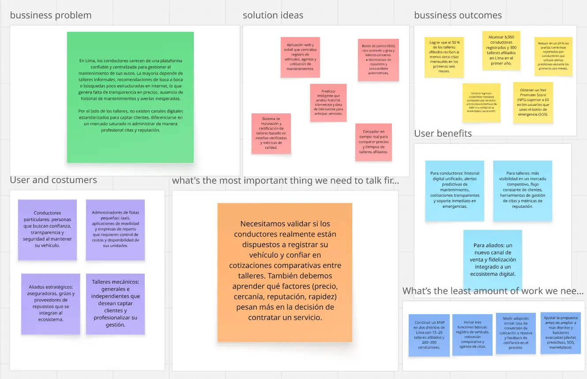

link en miro: https://miro.com/app/board/uXjVJ-y_4UE=/ 

## 1.3. Segmentos objetivo
**Conductores de vehículos particulares**

Este segmento incluye a propietarios de automóviles particulares. De acuerdo con la Asociación Automotriz del Perú (AAP), en 2023 el parque automotor peruano superó los 3,5 millones de vehículos, de los cuales más del 65 % se concentran en Lima y Callao (AAP, 2023). Este crecimiento constante genera una demanda creciente de servicios de mantenimiento y reparación. Sin embargo, los conductores enfrentan problemas de informalidad en talleres, sobrecostos y ausencia de historiales de servicio digitalizados, lo que afecta la seguridad y la eficiencia del uso de sus vehículos.
Para este grupo, Roffies ofrece beneficios como la centralización del historial de mantenimientos, alertas predictivas basadas en kilometraje y data de fabricantes, cotizaciones transparentes entre talleres y un botón de emergencia para asistencia inmediata en ruta. Estos atributos incrementan la confianza, reducen costos imprevistos y mejoran la seguridad vial en una ciudad con altos índices de congestión y accidentes.

**Talleres mecánicos afiliados (generales y especializados)**

El segundo segmento lo conforman talleres mecánicos independientes y especializados que operan en Lima Metropolitana. Según datos del Instituto Nacional de Estadística e Informática (INEI), más del 70 % de los talleres automotrices en el Perú son micro y pequeñas empresas (MYPEs), con un alto nivel de informalidad y escasa digitalización (INEI, 2022). La mayoría carece de herramientas tecnológicas para gestionar clientes, mejorar su reputación y competir en un mercado cada vez más exigente.
Para los talleres, Roffies representa una oportunidad de transformación digital: visibilidad en un marketplace confiable, captación de clientes nuevos sin altos costos de publicidad, sistema de reputación con reseñas verificadas y herramientas para gestionar agendas y métricas de desempeño. Al integrarse en la plataforma, los talleres pueden diferenciarse de la competencia, fidelizar clientes y aumentar sus ingresos.

---

# Capítulo II: Requirements Elicitation & Analysis

## 2.1. Competidores

<table style="width: 100%; border-collapse: collapse; font-family: Arial, sans-serif;">
    <tr>
        <td colspan="5" style="border: 1px solid black; padding: 8px; vertical-align: top; "><strong>Competitive Analysis Landscape</strong></td>
    </tr>
    <tr>
        <td style="border: 1px solid black; padding: 8px; vertical-align: top;"><strong>¿Por qué llevar a cabo este análisis?</strong></td>
        <td colspan="4" style="border: 1px solid black; padding: 8px; vertical-align: top;">
            Comprender cómo se diferencia Roffies de sus principales competidores en Lima, identificar oportunidades de mejora en el mercado automotriz y validar nuestra ventaja competitiva para consolidarnos como la plataforma número uno de gestión de mantenimientos y talleres en el Perú.
        </td>
    </tr>
    <tr>
        <td style="border: 1px solid black; padding: 8px; vertical-align: top;">Marca y Logo</td>
        <td style="border: 1px solid black; padding: 8px; vertical-align: top;"><strong>Roffies</strong> </td>
        <td style="border: 1px solid black; padding: 8px; vertical-align: top;"><strong>Concesionarios oficiales</strong> </td>
        <td style="border: 1px solid black; padding: 8px; vertical-align: top;"><strong>Plataformas de Asistencia Vehicular </td>
        <td style="border: 1px solid black; padding: 8px; vertical-align: top;"><strong>Talleres Independientes </td>
    </tr>
    <tr>
        <td rowspan="2" style="border: 1px solid black; padding: 8px; vertical-align: top; width: 15%;"><strong>Perfil</strong></td>
        <td style="border: 1px solid black; padding: 8px; vertical-align: top;"><strong>Overview</strong> Plataforma digital que centraliza talleres afiliados, conecta conductores y ofrece historial de vehículo, alertas predictivas, cotizador y botón de emergencia.</td>
        <td style="border: 1px solid black; padding: 8px; vertical-align: top;">Servicios formales con repuestos originales y garantía de fábrica, orientados a clientes de marca en periodo de garantía.</td>
        <td style="border: 1px solid black; padding: 8px; vertical-align: top;">Apps de aseguradoras y servicios de grúa que atienden emergencias, pero sin integrar historial ni predicción de mantenimientos.</td>
        <td style="border: 1px solid black; padding: 8px; vertical-align: top;">Talleres locales con precios accesibles y flexibilidad, pero sin estandarización ni transparencia en costos.</td>
    </tr>
    <tr>
        <td style="border: 1px solid black; padding: 8px; vertical-align: top;"><strong>Ventaja competitiva</strong> - Historial digital unificado - Alertas predictivas - Cotizador en tiempo real - Botón SOS - Marketplace de repuestos</td>
        <td style="border: 1px solid black; padding: 8px; vertical-align: top;">- Garantía de fábrica - Repuestos originales - Confianza de marca</td>
        <td style="border: 1px solid black; padding: 8px; vertical-align: top;">- Atención 24/7 en emergencias - Red de grúas - Integración con seguros</td>
        <td style="border: 1px solid black; padding: 8px; vertical-align: top;">- Precios económicos - Flexibilidad - Cercanía geográfica</td>
    </tr>
    <tr>
        <td rowspan="2" style="border: 1px solid black; padding: 8px; vertical-align: top;"><strong>Perfil de Marketing</strong></td>
        <td style="border: 1px solid black; padding: 8px; vertical-align: top;"><strong>Mercado objetivo</strong> Conductores de autos particulares y talleres en Lima Metropolitana.</td>
        <td style="border: 1px solid black; padding: 8px; vertical-align: top;">Clientes con vehículos nuevos en garantía y usuarios que priorizan repuestos originales.</td>
        <td style="border: 1px solid black; padding: 8px; vertical-align: top;">Usuarios asegurados y conductores que enfrentan emergencias en ruta.</td>
        <td style="border: 1px solid black; padding: 8px; vertical-align: top;">Conductores que buscan precios bajos y talleres de barrio.</td>
    </tr>
    <tr>
        <td style="border: 1px solid black; padding: 8px; vertical-align: top;"><strong>Estrategias de marketing</strong> - Publicidad digital - Alianzas con aseguradoras - Estrategia inbound - Casos de éxito</td>
        <td style="border: 1px solid black; padding: 8px; vertical-align: top;">- Promociones en concesionarios - Publicidad tradicional - Alianzas con fabricantes</td>
        <td style="border: 1px solid black; padding: 8px; vertical-align: top;">- Promoción con seguros - Paquetes de asistencia - Programas de fidelización</td>
        <td style="border: 1px solid black; padding: 8px; vertical-align: top;">- Volantes - Recomendaciones - Precios bajos</td>
    </tr>
    <tr>
        <td rowspan="3" style="border: 1px solid black; padding: 8px; vertical-align: top;"><strong>Perfil de Producto</strong></td>
        <td style="border: 1px solid black; padding: 8px; vertical-align: top;"><strong>Productos & Servicios</strong> - Agenda online - Alertas predictivas - Cotizador en tiempo real - Botón SOS - Marketplace - Reputación talleres</td>
        <td style="border: 1px solid black; padding: 8px; vertical-align: top;">- Mantenimiento preventivo y correctivo - Repuestos originales - Servicios exclusivos por marca</td>
        <td style="border: 1px solid black; padding: 8px; vertical-align: top;">- Servicio de grúa 24/7 - Cambio de llantas y batería - Asistencia en carretera</td>
        <td style="border: 1px solid black; padding: 8px; vertical-align: top;">- Servicios generales - Reparaciones rápidas</td>
    </tr>
    <tr>
        <td style="border: 1px solid black; padding: 8px; vertical-align: top;"><strong>Precios & Costos</strong> Freemium + comisión + suscripción premium + margen en repuestos</td>
        <td style="border: 1px solid black; padding: 8px; vertical-align: top;">30–50% más caros que talleres independientes</td>
        <td style="border: 1px solid black; padding: 8px; vertical-align: top;">Incluido en seguros o S/30–50 mensuales</td>
        <td style="border: 1px solid black; padding: 8px; vertical-align: top;">Costos bajos y negociables</td>
    </tr>
    <tr>
        <td style="border: 1px solid black; padding: 8px; vertical-align: top;"><strong>Canales de distribución</strong> Web y app móvil</td>
        <td style="border: 1px solid black; padding: 8px; vertical-align: top;">Presencial, call center o web básica</td>
        <td style="border: 1px solid black; padding: 8px; vertical-align: top;">Apps móviles y contacto telefónico</td>
        <td style="border: 1px solid black; padding: 8px; vertical-align: top;">Atención presencial y referencias locales</td>
    </tr>
    <tr>
        <td rowspan="4" style="border: 1px solid black; padding: 8px; vertical-align: top;"><strong>Análisis SWOT</strong></td>
        <td style="border: 1px solid black; padding: 8px; vertical-align: top;"><strong>Fortalezas</strong> - Plataforma integral - Historial único - Transparencia de precios - Funciones diferenciales</td>
        <td style="border: 1px solid black; padding: 8px; vertical-align: top;">- Marca fuerte - Garantía - Infraestructura moderna</td>
        <td style="border: 1px solid black; padding: 8px; vertical-align: top;">- Cobertura nacional - Atención rápida</td>
        <td style="border: 1px solid black; padding: 8px; vertical-align: top;">- Precios bajos - Cercanía - Flexibilidad</td>
    </tr>
    <tr>
        <td style="border: 1px solid black; padding: 8px; vertical-align: top;"><strong>Debilidades</strong> - Comunidad pequeña - Dependencia de talleres - Generar confianza</td>
        <td style="border: 1px solid black; padding: 8px; vertical-align: top;">- Costos altos - Atención limitada - Baja flexibilidad</td>
        <td style="border: 1px solid black; padding: 8px; vertical-align: top;">- No abordan mantenimientos preventivos - Limitados a emergencias</td>
        <td style="border: 1px solid black; padding: 8px; vertical-align: top;">- Falta de transparencia - Escasa profesionalización - Sin historial digital</td>
    </tr>
    <tr>
        <td style="border: 1px solid black; padding: 8px; vertical-align: top;"><strong>Oportunidades</strong> - Crecimiento parque automotor - Digitalización - Alianzas con aseguradoras</td>
        <td style="border: 1px solid black; padding: 8px; vertical-align: top;">- Ventas de autos nuevos - Expansión posventa</td>
        <td style="border: 1px solid black; padding: 8px; vertical-align: top;">- Aumento de seguros vehiculares</td>
        <td style="border: 1px solid black; padding: 8px; vertical-align: top;">- Crecer si se formalizan</td>
    </tr>
    <tr>
        <td style="border: 1px solid black; padding: 8px; vertical-align: top;"><strong>Amenazas</strong> - Aparición de startups - Resistencia a formalizarse - Baja adopción tecnológica</td>
        <td style="border: 1px solid black; padding: 8px; vertical-align: top;">- Pérdida de clientes por costos - Competencia talleres independientes</td>
        <td style="border: 1px solid black; padding: 8px; vertical-align: top;">- Nuevas startups con SOS + mantenimiento - Cambios regulatorios</td>
        <td style="border: 1px solid black; padding: 8px; vertical-align: top;">- Desconfianza de usuarios - Falta de certificaciones - Competencia digital</td>
    </tr>
</table>

## 2.1.2. Estrategias y tácticas frente a competidores

En base al análisis competitivo y al SWOT previo, definimos un conjunto de estrategias y tácticas para que Roffies aproveche nuestras fortalezas, subsane nuestras debilidades, explote las oportunidades de mercado y mitigue las amenazas derivadas de la competencia.

**Afrontando las fortalezas de nuestros competidores**
**Fortalezas de los competidores**
- Concesionarios oficiales: confianza de marca, repuestos originales y servicios certificados.
- Aseguradoras y apps de asistencia: cobertura 24/7 y red de grúas nacionales.
- Talleres independientes: precios accesibles, flexibilidad y proximidad al usuario.

**Nuestras fortalezas**
- Historial digital unificado y accesible del vehículo.
- Alertas predictivas basadas en datos de fabricantes, kilometraje e historial.
- Cotizador en tiempo real con comparación entre talleres.
- Botón SOS con conexión inmediata a grúa y taller cercano.
- Marketplace de repuestos y servicios.

**Estrategias**
- Diferenciación tecnológica
Posicionar Roffies como la única plataforma que combina historial digital, predicción de averías y cotización instantánea.
- Confianza híbrida
Alianzas estratégicas con concesionarios y aseguradoras para sumar legitimidad a nuestra plataforma.
- Accesibilidad y conveniencia
Garantizar que el usuario tenga más opciones, mejores precios y atención más rápida que en cualquier competidor aislado.

**Tácticas**
- Lanzar campañas de comunicación mostrando comparativas de precios y tiempos entre Roffies vs. concesionarios.
- Crear un programa de “taller verificado” con insignias que validen calidad y confianza.
- Ofrecer descuentos exclusivos en la primera atención a través de la app.

**Afrontando las debilidades de nuestros competidores**
**Debilidades de los competidores**
- Concesionarios: costos elevados y atención limitada a una sola marca.
- Aseguradoras: servicios enfocados en emergencias, no en mantenimientos preventivos.
- Talleres independientes: falta de estandarización y poca transparencia en precios.

**Nuestras debilidades**
- Comunidad inicial pequeña y limitada adopción digital en talleres de Lima.
- Dependencia de la afiliación voluntaria de talleres.
- Necesidad de generar confianza en usuarios que tradicionalmente van a su “mecánico de confianza”.

**Estrategias**
- Programa de adopción temprana
Incentivar la afiliación de talleres con planes gratuitos iniciales y beneficios en visibilidad.
- Educación al consumidor
Campañas de concientización sobre los riesgos de no llevar historial de mantenimiento.

**Tácticas**
- Entregar un “certificado digital de mantenimiento” gratuito a los primeros talleres afiliados.
- Crear contenido educativo en redes sobre seguridad vial y mantenimiento preventivo.
- Organizar ferias o eventos presenciales de talleres afiliados para construir confianza en la marca.

**Aprovechando las oportunidades del mercado**
**Oportunidades detectadas**
- Crecimiento del parque automotor en Lima (más de 2,8 millones de vehículos).
- Baja digitalización de los talleres mecánicos, lo que abre espacio a soluciones tecnológicas.
- Tendencia global hacia la movilidad segura y los mantenimientos predictivos.

**Nuestras oportunidades**
- Posicionarnos como el primer historial digital del vehículo en Perú.
Convertirnos en puente entre aseguradoras, concesionarios y talleres independientes.

**Estrategias**
**Integración aseguradora**
Ofrecer a las compañías de seguros acceso al historial de mantenimiento para premiar a los usuarios con mejores condiciones.

**Marketplace escalable**
Incorporar venta de repuestos originales y alternativos dentro de la app.

**Expansión territorial**
Escalar el modelo desde Lima hacia provincias con alta densidad de vehículos (Arequipa, Trujillo, Piura)
**Tácticas**
- Pilotar con una aseguradora en Lima descuentos en pólizas por historial validado.
- Crear alianzas con importadores de repuestos locales.
- Publicar reportes anuales del estado del parque automotor como referencia de la industria.
  
**Mitigando las amenazas del entorno**
**Amenazas principales**
- Aparición de startups similares con mejor financiamiento.
- Resistencia cultural de talleres independientes a formalizar procesos digitales.
- Cambios regulatorios en seguros y movilidad.
  
**Nuestras amenazas**
- Baja adopción inicial de la aplicación en usuarios tradicionales.
- Dificultades para consolidar una red amplia de talleres confiables al inicio.
**Estrategias**
**Construcción de confianza**
Implementar un sello de “Roffies Garantizado” con estándares mínimos de calidad para talleres.
**Escalabilidad flexible**
Diseñar la plataforma con capacidad de adaptarse a normativas y nuevas alianzas.
**Tácticas**
- Publicar casos de éxito de talleres independientes que incrementaron clientes gracias a Roffies.
- Crear un plan de soporte técnico y capacitación digital para talleres afiliados.
- Monitorear cambios regulatorios y adaptar la plataforma a estándares internacionales de movilidad y datos.

## 2.2. Entrevistas
La sección cubre el proceso de exploración de nuestros segmentos objetivos a través de la recopilación de datos obtenidos mediante entrevistas.
### 2.2.1. Diseño de entrevistas
## Diseño de entrevista – Primer segmento objetivo: Dueños de vehículos
1. ¿Cuál es su nombre?
2. ¿Qué edad tiene?
3. ¿Qué tipo de vehículo conduce (auto, camioneta, moto, etc.)?
4. ¿Con qué frecuencia suele llevar su vehículo a mantenimiento o reparación?
5. ¿Cómo elige actualmente un taller mecánico cuando necesita servicio?
6. ¿Prefiere concesionarios oficiales o talleres independientes? ¿Por qué?
7. ¿Alguna vez ha tenido una mala experiencia con un taller? ¿Qué ocurrió?
8. ¿Qué tan importante es para usted tener un historial de mantenimientos accesible?
9. ¿Le gustaría recibir alertas predictivas de mantenimiento según kilometraje o historial?
10. ¿Cómo realiza actualmente las comparaciones de precios entre talleres?
11. En caso de una avería en ruta, ¿qué hace normalmente para resolverlo? ¿Qué valoraría más en una aplicación como Roffies: rapidez, transparencia en precios, cercanía de talleres, historial digital, o asistencia en emergencias?
12. ¿Qué lo motivaría a descargar y usar regularmente una aplicación de este tipo?

---

## Diseño de entrevista – Segundo segmento objetivo: Talleres mecánicos
1. ¿Cuál es el nombre de su taller?
2. ¿Cuántos años lleva operando?
3. ¿Qué tipo de servicios ofrecen (general, especializado en marcas, eléctrico, etc.)?
4. ¿Cómo suelen captar a sus clientes actualmente?
5. ¿Qué tan importante es para usted aparecer en plataformas digitales para atraer más clientes?
6. ¿Han tenido problemas con clientes que no regresan por falta de seguimiento?
7. ¿Qué beneficios cree que traería llevar un registro digital de mantenimientos de cada vehículo?
8. ¿Cómo manejan actualmente la cotización de servicios? ¿Se hace manual o con software especializado?
9. ¿Estarían interesados en que los clientes pudieran programar sus citas en línea?
10. ¿Qué opina de integrar alertas de mantenimiento para recordar a sus clientes que vuelvan al taller?
11. ¿Le gustaría contar con un botón SOS que traiga clientes con emergencias a su taller más cercano?
12. ¿Qué condiciones deberían cumplirse para que su taller se afilie a una plataforma como Roffies?
13. ¿Qué lo motivaría a pagar una suscripción premium que le dé más visibilidad frente a otros talleres?

### 2.2.2. Registro de entrevistas

## Entrevista para el Segmento Objetivo 1 - Dueños de vehículos:

**Entrevista N°1:**

**Entrevistado:** Sebastián De Las Casas  

**Sexo:** Masculino

**Edad:** 21 años 

**Inicio de la Entrevista:** 0:00

**Duración de la Entrevista:** 3:31

**Resumen de la Entrevista:**
Sebastián, conductor de 21 años, realiza chequeos a su vehículo de manera periódica (cada seis meses o una vez al año). Para elegir un taller, recurrió inicialmente a Google y seleccionó el primero que encontró, aunque manifiesta mayor confianza en los talleres oficiales de marca.  
No ha tenido malas experiencias previas, pero considera muy valioso conocer con claridad las acciones realizadas durante un mantenimiento. Asimismo, destaca la importancia de recibir **alertas predictivas sobre reparaciones y kilometraje**, ya que le permitirían anticiparse a problemas.  
Actualmente no compara precios ni talleres, prefiere acudir siempre al mismo establecimiento por confianza. En caso de una avería inesperada, llama directamente a un taller en el momento. Finalmente, subraya que uno de los factores que más valoraría en un servicio digital como **SmartCare** sería la **rapidez en la asistencia en emergencias**.

**Enlace:** https://youtu.be/TZH8wQTGVig

## Entrevista para el Segmento Objetivo 2 - Talleres Mecánicos:

**Entrevista N°1:**

**Entrevistado:** Giancarlo Castañeda

**Sexo:** Masculino

**Edad:** 23

**Inicio de la Entrevista:** 0:00

**Duración de la Entrevista:** 7:07

**Resumen de la Entrevista:** 
RM AUTOMOTRIZ es un taller con 8 años de experiencia que ofrece mecánica general y servicios eléctricos básicos. Actualmente capta clientes principalmente por recomendaciones, ubicación y un uso limitado de redes sociales, pero reconoce la importancia de fortalecer su presencia digital. El taller enfrenta problemas de seguimiento, ya que muchos clientes no regresan por falta de recordatorios, y aún maneja cotizaciones de forma manual. Ven con interés la implementación de herramientas como agenda en línea, alertas de mantenimiento y un botón SOS para emergencias, ya que mejorarían la organización, fidelización y captación de clientes. Para afiliarse a una plataforma como Roffies consideran clave la confianza, la visibilidad y costos razonables, y estarían dispuestos a pagar una suscripción premium siempre que garantice mayor exposición, acceso a clientes verificados y beneficios adicionales como estadísticas y recordatorios automatizados

**Enlace:** https://youtu.be/SmuCdvWBeUU

### 2.2.3. Análisis de entrevistas

**Segmento 1: Dueños de vehículos**
La entrevista con Sebastián, conductor de 21 años, evidencia un perfil de usuario que valora la confianza y transparencia en los talleres. Aunque inicialmente eligió un taller mediante Google, reconoce que su preferencia recae en talleres oficiales, ya que le transmiten mayor seguridad. Si bien no ha tenido experiencias negativas, considera fundamental que en cada mantenimiento se le explique con claridad las acciones realizadas y los repuestos utilizados. Subraya como necesidad clave la incorporación de alertas predictivas de kilometraje y reparaciones, que le permitan anticiparse a fallos y evitar gastos imprevistos. Su patrón de consumo es estable, dado que no compara precios ni cambia de taller, lo que muestra que su fidelidad está ligada a la confianza más que al costo. En casos de emergencia, recurre a la llamada directa, aunque destaca que valoraría enormemente un servicio como SmartCare por la rapidez en la asistencia en situaciones inesperadas. Esto refleja que su prioridad es un sistema que combine inmediatez, transparencia y seguridad en la atención.

**Segmento 2: Talleres mecánicos**

La entrevista con RM Automotriz revela que, pese a tener 8 años de experiencia en mecánica general y servicios eléctricos básicos, su modelo de captación de clientes sigue siendo principalmente tradicional, basado en recomendaciones, ubicación y un uso limitado de redes sociales. Esto ha generado limitaciones en fidelización, ya que muchos clientes no regresan por la falta de recordatorios y seguimiento. Además, el taller enfrenta procesos poco eficientes al seguir utilizando cotizaciones manuales, lo que repercute en tiempos muertos y poca organización. Reconocen la necesidad de digitalizarse y ven con gran interés herramientas como agenda en línea, alertas de mantenimiento y botón SOS, las cuales consideran que fortalecerían su relación con los clientes y su posicionamiento frente a la competencia. Su disposición a pagar una suscripción premium depende de que la plataforma garantice confianza, visibilidad, acceso a clientes verificados y estadísticas útiles para mejorar la gestión y fidelización de su cartera.

## 2.3. Needfinding
En esta sección se presentarán los artefactos resultantes del proceso de análisis de la información recolectada de los segmentos objetivos

### 2.3.1. User Personas

User Persona del Primer Segmento objetivo:

| **Name** | **Type** | **Age** | **Gender** | **Location** | **Vehicle** |
|----------|----------|---------|------------|--------------|-------------|
| Sebastián de Las Casas | Conductor Particular | 21 años | Masculino | Lima | Auto sedán |

| **Goals** | **Quote** |
|-----------|-----------|
| - Mantener su vehículo en óptimas condiciones con chequeos cada 6 meses o 1 año.   - Conocer con claridad qué se hace en cada mantenimiento.   - Recibir asistencia rápida en emergencias. | *"Es bueno saber qué le hacen a mi carro en el mantenimiento y tener alertas cuando toca revisar algo."* |

| **Background** |
|----------------|
| Sebastián eligió su primer taller buscando en Google, pero actualmente confía más en talleres oficiales. No suele comparar precios ni buscar varias opciones: prefiere regresar siempre al mismo taller. En caso de emergencia, llama directamente al taller más cercano. |

| **Motivations** | **Frustrations** |
|-----------------|------------------|
| - Confianza en talleres oficiales.   - Alertas de mantenimiento (kilometraje, revisiones, etc.).   - Transparencia en servicios y precios.   - Rapidez en la asistencia. | - No compara precios, por lo que no sabe si paga justo.   - Diagnósticos poco claros en algunos casos.   - Falta de opciones centralizadas para revisar talleres. |

User Persona del Segundo segmento objetivo:

| **NAME** | RM Automotriz |
|----------|----------------|
| **TYPE** | Taller de Mecánica General |

| **Demographic** | **Details** |
|-----------------|-------------|
| **Años de experiencia** | 8 |
| **Servicios** | Mecánica general, servicios eléctricos básicos |
| **Ubicación** | Lima |
| **Clientes actuales** | Captados por recomendaciones, ubicación y redes sociales limitadas |

| **Goals** | **Quote** |
|-----------|-----------|
| - Captar más clientes de forma constante.   - Fidelizar a los que ya atendieron.   - Digitalizar procesos de agenda y cotización.   - Aumentar visibilidad en el mercado. | *"Necesitamos más exposición y herramientas digitales para organizarnos y no perder clientes."* |

| **Background** |
|----------------|
| RM Automotriz es un taller con 8 años en el mercado. Maneja cotizaciones manualmente y pierde clientes porque no tienen recordatorios. Reconocen la necesidad de digitalizarse y ven con interés herramientas como agenda online, botón SOS y estadísticas para diferenciarse. |

| **Motivations** | **Frustrations** |
|-----------------|------------------|
| - Acceso a clientes verificados.   - Mayor visibilidad digital.   - Herramientas para organizar agenda y cotizaciones.   - Fidelización a través de recordatorios automáticos. | - Falta de recordatorios hace que los clientes no regresen.   - Cotizaciones manuales generan errores y demoras.   - Uso limitado de redes sociales limita alcance. |

### 2.3.2. User Task Matrix
## Perfil 1: Ciudadano conductor de la via pública  
| User Task | Frequency | Importance |
|-----------|-----------|------------|
| Llevar el auto a chequeos cada 6 meses o 1 año | Often | High |
| Buscar taller en Google o directorios | Sometimes | Medium |
| Confiar en talleres oficiales de marca | Often | High |
| No realizar comparaciones, ir siempre al mismo taller | Often | Medium |
| Llamar a un taller en caso de emergencia | Sometimes | High |
| Revisar qué servicios se realizaron en el mantenimiento | Sometimes | High |
| Valorar rapidez en la asistencia y soluciones | Often | High |

---

## Perfil 2: Taller Mecanico  

| **User Task** | **Frequency** | **Importance** |
|---------------|---------------|----------------|
| Atender clientes que llegan por recomendación o ubicación | Often | High |
| Gestionar cotizaciones manualmente (papel/WhatsApp) | Often | High |
| Hacer seguimiento a clientes para que regresen | Rarely | High |
| Publicar en redes sociales para captar clientes | Sometimes | Medium |
| Responder llamadas o mensajes de emergencia | Sometimes | Medium |
| Coordinar repuestos con proveedores | Sometimes | Medium |
| Registrar historial de clientes o servicios realizados | Rarely | Medium |
| Evaluar costos y pagos de servicios | Often | High |

### 2.3.3. User Journey Mapping

User Journey Mapping del Primer segmento objetivo:
| Fase | User Goals | TouchPoints | Customer Thoughts | Experience | Ideas/Opportunities |
|------|------------|-------------|-------------------|------------|---------------------|
| **Salida** | Revisar el estado del vehículo periódicamente | Búsqueda en Google o contacto directo con taller | “¿Dónde llevo mi auto esta vez?” | Neutral 🙂 | Mostrar talleres cercanos con historial y reputación |
| **Búsqueda** | Encontrar un taller confiable | Google, recomendaciones, talleres oficiales | “Confío más en los talleres oficiales” | Serenidad 😌 | Validar reputación y precios en una sola plataforma |
| **Observación** | Conocer qué se hará en el mantenimiento | Conversación directa con el taller | “Quiero saber qué le hacen a mi auto” | Pensiveness 🤔 | Ofrecer detalle digital del servicio y repuestos usados |
| **Evaluación** | Decidir dónde llevar el auto | Comparación (limitada) entre opciones | “Prefiero ir al mismo taller de siempre” | Indecisión 😕 | Cotizador en tiempo real para comparar precios |
| **Selección / Uso** | Resolver problema o mantenimiento | Llamada al taller o asistencia SOS | “Necesito rapidez en la asistencia” | Serenidad 😌 | Botón SOS con asistencia inmediata y grúas disponibles |

User Journey Mapping Segundo segmento objetivo:

| Fase | User Goals | TouchPoints | Customer Thoughts | Experience | Ideas/Opportunities |
|------|------------|-------------|-------------------|------------|---------------------|
| **Captación** | Atraer más clientes de forma constante | Recomendaciones, ubicación, redes sociales limitadas | “Dependemos mucho del boca a boca.” | Neutral 🙂 | Plataforma que brinde visibilidad digital y acceso a clientes verificados |
| **Cotización** | Dar precios claros y rápidos | Cotizaciones manuales (papel, WhatsApp) | “Esto nos hace perder tiempo.” | Frustración 😣 | Cotizador en línea automatizado que estandarice precios |
| **Servicio** | Brindar un buen mantenimiento o reparación | Atención presencial en el taller | “Espero que el cliente quede satisfecho.” | Serenidad 😌 | Agenda digital y registro automático del servicio realizado |
| **Seguimiento** | Lograr que el cliente regrese al taller | Llamadas esporádicas, casi sin recordatorios | “Los clientes se olvidan de regresar.” | Indecisión 😕 | Alertas automáticas de mantenimiento y kilometraje |
| **Fidelización** | Diferenciarse y generar confianza a largo plazo | Contacto directo, recomendaciones | “Necesitamos destacar frente a la competencia.” | Pensiveness 🤔 | Reportes de desempeño, reseñas verificadas y programa de fidelización |

### 2.3.4. Empathy Mapping

Empathy Mapping del Priemer segmento objetivo:

| **1. WHO are we empathizing with?** | Sebastián de Las Casas, conductor particular que busca confianza y rapidez en el mantenimiento de su auto. |
|-------------------------------------|-------------------------------------------------------------------------------------------------------------|
| **2. What do they need to DO?** | - Recibir alertas predictivas de mantenimiento y kilometraje   - Conocer con claridad qué se hace en cada servicio   - Acceder rápido a talleres confiables |
| **3. What do they SEE?** | - Talleres con precios diferentes y poca transparencia   - Mercado fragmentado (oficiales vs independientes)   - Diagnósticos poco claros |
| **4. What do they SAY?** | - “Confío más en un taller oficial.”   - “Es bueno recibir alertas de mantenimiento y kilometraje.”   - “Valoro la rapidez en la asistencia si ocurre un problema.” |
| **5. What do they DO?** | - Realiza chequeos cada 6 meses o 1 año   - Busca talleres en Google pero confía en oficiales   - Llama al taller en caso de emergencia |
| **6. What do they HEAR?** | - Opiniones de amigos y conocidos   - Recomendaciones de Google   - Mensajes de confianza en talleres oficiales |
| **7. What do they THINK and FEEL?** | - Necesita transparencia en los diagnósticos   - Siente que las alertas serían útiles para prevenir fallos   - Prefiere seguridad a bajo precio |
| **PAINS** | - No siempre sabe si paga un precio justo   - Poca información clara de talleres   - Dependencia de un solo taller |
| **GAINS** | - Rapidez en asistencia   - Claridad en diagnósticos   - Alertas predictivas para evitar averías costosas |

Empathy Mapping del Segundo segmento objetivo:

| **1. WHO are we empathizing with?** | RM Automotriz, taller con 8 años de experiencia que busca digitalizarse, captar más clientes y fidelizarlos mediante herramientas modernas. |
|-------------------------------------|----------------------------------------------------------------------------------------------------------------------------|
| **2. What do they need to DO?** | - Captar clientes nuevos de manera constante   - Fidelizar a los clientes actuales con recordatorios   - Gestionar agenda y cotizaciones en línea   - Mejorar su visibilidad digital |
| **3. What do they SEE?** | - Competidores con mayor presencia en redes sociales   - Clientes que no regresan por falta de recordatorios   - Procesos manuales que generan demoras |
| **4. What do they SAY?** | - “Necesitamos más exposición digital.”   - “Los clientes se olvidan de volver al taller.”   - “Manejamos todo manual y eso nos quita tiempo.” |
| **5. What do they DO?** | - Atienden clientes por recomendación o ubicación   - Elaboran cotizaciones manuales (papel/WhatsApp)   - Publican ocasionalmente en redes sociales   - Responden emergencias puntuales |
| **6. What do they HEAR?** | - Opiniones de clientes satisfechos pero sin seguimiento   - Comentarios sobre precios de talleres oficiales   - Recomendaciones de colegas y vecinos |
| **7. What do they THINK and FEEL?** | - Se frustran al perder clientes por falta de recordatorios   - Sienten que necesitan digitalizarse para competir   - Valoran la confianza y visibilidad que les pueda dar una plataforma como Roffies |
| **PAINS** | - Procesos manuales poco eficientes   - Poca presencia digital   - Pérdida de clientes recurrentes |
| **GAINS** | - Acceso a clientes verificados y constantes   - Mayor exposición digital   - Organización y estadísticas para mejorar el negocio |

### 2.3.5. As-is Scenario Mapping

En esta sección describimos el proceso que seguimos para construir los As-Is Scenario Mapping de cada segmento objetivo. Partimos de una lluvia de ideas individual, luego revisamos en equipo las acciones reales de los usuarios, identificamos las fases clave de sus procesos.

**As-Is Scenario Mapping – Conductores**

| **Steps** | Identificar necesidad de mantenimiento | Buscar taller | Elegir taller | Realizar mantenimiento | Revisar resultado |
|-----------|-----------------------------------------|---------------|---------------|------------------------|------------------|
| **Phases** | Detectar problema o revisión por tiempo/kilometraje | Buscar opciones en Google, recomendaciones o cercanía | Decidir entre taller oficial o independiente | Acudir al taller, dejar vehículo y esperar diagnóstico | Recibir el carro y evaluar el servicio |
| **Doing** | - Nota un ruido o recibe alerta en tablero   - Se da cuenta que toca el chequeo por kilometraje | - Busca en Google “taller cerca de mí”   - Pregunta a amigos/familia   - Considera concesionarios oficiales | - Elige el primer taller encontrado   - O confía en el taller oficial que ya conoce | - Entrega su auto   - Escucha diagnóstico del mecánico   - Acepta el servicio sin mucha comparación | - Recoge el auto   - Paga el servicio   - Guarda la boleta o factura |
| **Thinking** | “¿Será grave este problema?”   “¿Cuánto me costará la reparación?” | “¿Este taller será confiable?”   “¿Me estarán cobrando lo justo?” | “Prefiero el oficial, me da más confianza.”   “No tengo tiempo de comparar.” | “Espero que el trabajo esté bien hecho.”   “¿Están usando piezas originales?” | “¿Realmente hicieron lo que dijeron?”   “Espero no tener sorpresas luego.” |
| **Feeling** | Preocupación por seguridad y costos | Duda e inseguridad por falta de transparencia | Confianza parcial (en oficiales) pero resignación en precios | Impaciencia y cierta desconfianza | Tranquilidad si no hay problemas, frustración si surgen fallos |

**As-Is Scenario Mapping – Talleres mecánicos**

| **Steps** | Captar clientes | Cotizar servicios | Atender en taller | Seguimiento post-servicio |
|-----------|-----------------|------------------|------------------|---------------------------|
| **Phases** | Llegan por recomendaciones o cercanía | Cotizan manualmente en papel o WhatsApp | Brindan servicio técnico | Poca o nula comunicación posterior |
| **Doing** | - Publican poco en redes.   - Confían en el boca a boca. | - Escriben precios manuales.   - Hacen cálculos en el momento. | - Atienden reparaciones básicas y generales. | - No envían recordatorios.   - Solo esperan que el cliente vuelva por iniciativa propia. |
| **Thinking** | “Necesitamos más visibilidad.” | “Esto nos hace perder tiempo y precisión.” | “Debemos diferenciarnos.” | “Estamos perdiendo clientes por falta de seguimiento.” |
| **Feeling** | Preocupación por poca captación | Frustración con procesos manuales | Orgullo por su experiencia técnica | Ansiedad por no fidelizar clientes |

## 2.4. Ubiquitous Language

Este documento define el Lenguaje Ubicuo (Ubiquitous Language) que se utilizará en el proyecto **Roffies** y su producto **SmartCare**. Su propósito es garantizar una comunicación clara y consistente entre todos los miembros del equipo y stakeholders.

### Términos Clave

1. **Conductor:** Usuario que posee un vehículo particular y utiliza la plataforma para gestionar mantenimientos, reparaciones y emergencias. Puede registrar uno o varios vehículos en su cuenta.  
2. **Taller Afiliado:** Establecimiento mecánico (independiente o especializado) que se afilia a Roffies para ofrecer servicios de mantenimiento, reparación y venta de repuestos a través de la plataforma.  
3. **SmartCare:** Producto principal de Roffies. Es el sistema que integra historial digital del vehículo, cotizador en tiempo real, alertas predictivas y botón SOS de emergencias.  
4. **Historial del Vehículo:** Registro digital único que almacena los mantenimientos, reparaciones, kilometraje y servicios realizados al vehículo, accesible para conductores y talleres afiliados.  
5. **Alerta Predictiva:** Notificación automática generada por la plataforma basada en kilometraje, historial y datos de fabricantes, que advierte al conductor sobre próximos mantenimientos o posibles averías.  
6. **Cotizador en Tiempo Real:** Herramienta que permite a los conductores comparar precios de distintos talleres antes de tomar una decisión, garantizando transparencia en costos.  
7. **Botón SOS:** Funcionalidad de SmartCare que conecta al conductor en emergencia con el taller más cercano o con un servicio de grúa aliado.  
8. **Reserva de Cita:** Proceso mediante el cual un conductor agenda un servicio en un taller afiliado a través de la plataforma.  
9. **Marketplace:** Espacio dentro de SmartCare donde los usuarios pueden adquirir productos automotrices como aceites, baterías, llantas y filtros, vinculados al historial de cada vehículo.  
10. **Gestión de Talleres:** Conjunto de herramientas digitales que permiten a los talleres administrar citas, tiempos de atención, métricas de desempeño y reputación en la plataforma.  
11. **Reputación Validada:** Sistema de puntuación basado en reseñas de conductores y cumplimiento de estándares de calidad por parte de los talleres.  
12. **Flujos de Ingresos:** Modelo híbrido de monetización que incluye comisiones por transacción, suscripciones premium para talleres y márgenes en ventas del marketplace.  
13. **Onboarding:** Proceso de introducción guiada para nuevos usuarios (conductores o talleres) en Roffies, que incluye tutoriales, asistencia digital y configuración inicial de perfiles.  
14. **Notificaciones Inteligentes:** Comunicaciones automáticas enviadas al conductor sobre citas próximas, servicios recomendados, ofertas de talleres y recordatorios de mantenimiento.  
15. **Panel de Control:** Espacio en la plataforma donde conductores y talleres acceden a métricas clave, historial de interacciones, próximas citas y alertas activas.  
16. **Feedback del Servicio:** Opiniones y calificaciones que los conductores otorgan a los talleres después de un servicio. Sirven para construir confianza y reputación validada.  
17. **Alianzas Estratégicas:** Convenios con aseguradoras, municipios, universidades y empresas de movilidad que ayudan a expandir el alcance de Roffies.  
18. **Emergencia Vial:** Situación inesperada en la ruta (accidente, avería, falla mecánica) donde el conductor puede utilizar el botón SOS para recibir asistencia inmediata.  
19. **Segmentos Objetivos:** Grupos principales a los que se dirige la plataforma: conductores privados de Lima Metropolitana y talleres mecánicos especializados o independientes.  
20. **Transformación Digital de Talleres:** Proceso mediante el cual talleres independientes adoptan Roffies para profesionalizar su gestión, aumentar visibilidad y captar clientes en un mercado competitivo.  

---

# Capítulo III: Requirements Specification
En este capítulo se especifican los requisitos del MVP de **SmartCare**, definidos a partir del análisis de usuarios, entrevistas y artefactos de investigación realizados previamente. El alcance se centra en dos funcionalidades principales: la gestión del historial digital de mantenimientos y el predictor de servicios y costos, que responden directamente a las necesidades identificadas en los segmentos objetivo (dueños de vehículo y dueños de talleres).  

Asimismo, se incluyen historias de negocio, técnicas y de soporte (Landing Page), necesarias para garantizar la operatividad, escalabilidad y valor integral del sistema.

## 3.1. To-Be Scenario Mapping
El mapeo de escenarios *To-Be* permite visualizar el flujo de trabajo deseado en el futuro, una vez implementadas las mejoras propuestas con **SmartCare**. Estos escenarios se construyeron en base a la investigación previa y muestran cómo la plataforma transformará la experiencia de los dueños de vehículo y talleres.  

Al compararlos con los escenarios actuales (*As-Is*), se identifican los cambios clave que introducirá nuestra solución: mayor trazabilidad del historial, predicciones de mantenimiento confiables y comunicación más transparente entre usuarios y talleres.  

A continuación, se presentan los escenarios *To-Be* para nuestros dos segmentos objetivos principales.

**To-Be Scenario: Segmento Objetivo - Dueño de vehículo**

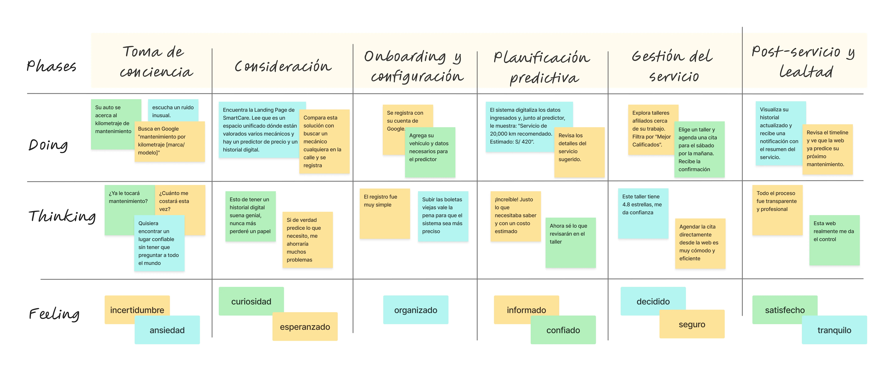

**To-Be Scenario: Segmento Objetivo - Jefe/Asesor de Taller Afiliado**

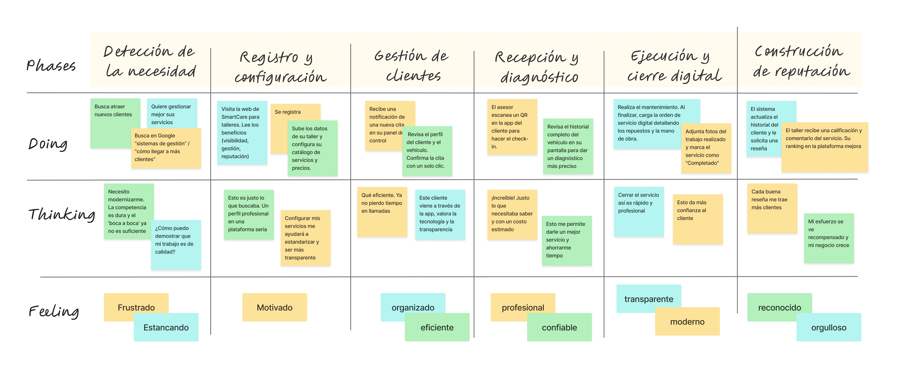

## 3.2. User Stories 
Las User Stories se redactaron a partir de las necesidades identificadas en la investigación previa, considerando los segmentos objetivo (dueños de vehículos y dueños de talleres). Además, se incluyen historias de negocio, técnicas y de soporte (Landing Page), que son necesarias para asegurar la correcta operación y adopción de **SmartCare**.

A continuación se presentan las epicas formuladas para elaborar las *User Stories*.

# Tabla de Épicas

| Epic ID | Título | Descripción |
| --- | --- | --- |
| EP01 | Cuentas y Acceso | **Como** usuario, **quiero** crear, autenticar y gestionar mi perfil **para** acceder de manera segura y personalizada a la plataforma. |
| EP02 | Vehículo e Historial Digital | **Como** dueño de vehículo, **quiero** registrar mis vehículos y consolidar su historial digital de mantenimiento **para** tener control y trazabilidad de todos los servicios realizados. |
| EP03 | Agenda y Citas | **Como** dueño de vehículo, **quiero** buscar talleres y gestionar mis citas (reserva, reprogramación, cancelación) **para** asegurar la atención de mi vehículo de forma conveniente. |
| EP04 | Gestión de Taller y Órdenes de Trabajo | **Como** jefe o asesor de taller, **quiero** administrar el perfil, la agenda y las órdenes de trabajo **para** organizar mejor mis operaciones y generar confianza en mis clientes. |
| EP05 | Predictor y Recomendaciones | **Como** dueño de vehículo, **quiero** recibir predicciones de mantenimiento basadas en historial, pautas y uso del vehículo **para** anticipar costos y prevenir averías. |
| EP06 | Comunicaciones y Notificaciones | **Como** usuario, **quiero** recibir correos y notificaciones transaccionales **para** estar informado oportunamente sobre mis citas y servicios. |
| EP07 | Catálogo y Datos Maestros | **Como** administrador, **quiero** gestionar tipos de servicio y pautas de fabricante **para** asegurar la consistencia de los datos y el correcto funcionamiento del predictor. |
| EP08 | Landing Page y Adquisición | **Como** visitante, **quiero** conocer la propuesta de valor y beneficios de la plataforma **para** decidir registrarme o afiliar mi taller. |
| EP09 | Arquitectura y Tareas Técnicas | **Como** desarrollador, **quiero** implementar tareas técnicas y configurar la arquitectura **para** garantizar la operatividad, seguridad y escalabilidad del sistema. |

Una vez definidas las Épicas que enmarcan la estrategia del producto, a continuación, se presenta la tabla detallada de Historias de Usuario:

### Tabla de Historias de Usuario

| ID | Título | Descripción | Criterios de Aceptación | ID Épica |
|----|--------|-------------|-----------------------------------------------|----------|
| US-001 | Registro con Email/SSO | Como nuevo usuario, quiero crear mi cuenta usando mi email o una red social **para acceder de manera rápida y segura a la plataforma**. | **Happy Path**: ***Given*** un usuario ingresa datos válidos en el formulario de registro, ***When*** confirma su registro, ***Then*** el sistema crea la cuenta y abre sesión automáticamente.   **Unhappy Path**: ***Given*** un usuario intenta registrarse con un email existente, ***When*** envía el formulario, ***Then*** el sistema muestra el mensaje de error “El email ya está en uso”. | EP01 |
| US-002 | Inicio de Sesión | Como usuario registrado, quiero iniciar sesión con mis credenciales **para acceder a mi panel personal sin inconvenientes**. | **Happy Path**: ***Given*** un usuario registrado ingresa su email y contraseña correctos, ***When*** selecciona “Iniciar Sesión”, ***Then*** el sistema lo redirige a su panel principal.   **Unhappy Path**: ***Given*** un usuario ingresa credenciales incorrectas, ***When*** intenta iniciar sesión, ***Then*** el sistema muestra el mensaje “Credenciales incorrectas” y no permite el acceso. | EP01 |
| US-003 | Recuperar Contraseña | Como usuario, quiero restablecer mi contraseña olvidada a través de mi email **para recuperar el acceso a mi cuenta de forma segura**. | **Happy Path**: ***Given*** un usuario ingresa un email registrado en la pantalla de recuperación, ***When*** solicita el restablecimiento, ***Then*** el sistema envía un email con un enlace para crear una nueva contraseña.   **Unhappy Path**: ***Given*** un usuario ingresa un email no registrado, ***When*** solicita el restablecimiento, ***Then*** el sistema muestra el mensaje “El email no se encuentra registrado”. | EP01 |
| US-004 | Completar Perfil de Dueño de vehículo | Como dueño de vehículo, quiero completar mi perfil con mi nombre y teléfono **para que los talleres puedan contactarme fácilmente**. | **Happy Path**: ***Given*** un dueño de vehículo autenticado abre su perfil, ***When*** guarda sus datos de contacto válidos, ***Then*** el sistema actualiza la información en su cuenta. | EP01 |
| US-005 | Alta de Vehículo | Como dueño de vehículo, quiero registrar mi vehículo (marca, modelo, año, placa) **para crear su garaje digital y organizar mejor mis mantenimientos**. | **Happy Path**: ***Given*** un dueño de vehículo en la sección “Mi Garaje”, ***When*** ingresa los datos válidos de un vehículo y guarda, ***Then*** el sistema agrega el vehículo a su lista.   **Unhappy Path**: ***Given*** un dueño de vehículo ingresa datos incompletos, ***When*** intenta guardar, ***Then*** el sistema muestra el mensaje “Complete todos los campos obligatorios”. | EP02 |
| US-006 | Registrar Lectura de Odómetro | Como dueño de vehículo, quiero registrar el kilometraje actual de mi vehículo **para alimentar el predictor y recibir recomendaciones de mantenimiento precisas**. | **Happy Path**: ***Given*** un dueño de vehículo selecciona un vehículo, ***When*** ingresa una lectura válida de odómetro y la guarda, ***Then*** el sistema añade la lectura al historial con fecha y hora.   **Unhappy Path**: ***Given*** un dueño de vehículo ingresa un valor no numérico, ***When*** intenta guardar, ***Then*** el sistema muestra el error “El valor de kilometraje no es válido”. | EP02 |
| US-007 | Cargar Historial Pasado | Como dueño de vehículo, quiero subir fotos de boletas antiguas y etiquetar servicios **para construir un historial inicial completo de mi vehículo**. | **Happy Path**: ***Given*** un dueño de vehículo sube la foto de una boleta, ***When*** etiqueta el servicio (ej. “Cambio de aceite”) con fecha y KM, ***Then*** el sistema crea un evento en el timeline del vehículo. | EP02 |
| US-008 | Ver Timeline de Servicios | Como dueño de vehículo, quiero ver el historial de mi vehículo en una línea de tiempo **para comprender fácilmente su historial de mantenimiento**. | **Happy Path**: ***Given*** un vehículo tiene servicios registrados, ***When*** el dueño de vehículo accede a su historial, ***Then*** el sistema muestra una lista cronológica de los eventos. | EP02 |
| US-009 | Filtrar Historial | Como dueño de vehículo, quiero filtrar el historial por tipo de servicio (ej. “frenos”) **para encontrar información específica rápidamente**. | **Happy Path**: ***Given*** un vehículo tiene múltiples servicios registrados, ***When*** el dueño de vehículo aplica el filtro “Frenos”, ***Then*** el sistema muestra únicamente esos servicios. | EP02 |
| US-010 | Descargar Comprobantes | Como dueño de vehículo, quiero descargar comprobantes (fotos, PDFs) de un servicio **para tener respaldo personal y administrativo**. | **Happy Path**: ***Given*** un servicio tiene un archivo adjunto, ***When*** el dueño de vehículo selecciona “Descargar”, ***Then*** el sistema descarga el archivo en su dispositivo. | EP02 |
| US-011 | Buscar Talleres | Como dueño de vehículo, quiero buscar talleres por cercanía o calificación **para encontrar la mejor opción de servicio para mi vehículo**. | **Happy Path**: ***Given*** un dueño de vehículo está en el mapa de talleres, ***When*** aplica el filtro “Más cercanos”, ***Then*** el sistema reordena la lista mostrando primero los más próximos. | EP03 |
| US-012 | Ver Perfil de Taller | Como dueño de vehículo, quiero ver el perfil de un taller (servicios, fotos, reseñas) **para decidir con confianza si agendar una cita**. | **Happy Path**: ***Given*** un dueño de vehículo selecciona un taller, ***When*** abre su perfil, ***Then*** el sistema muestra la información completa y comentarios de usuarios. | EP03 |
| US-013 | Reservar Cita | Como dueño de vehículo, quiero reservar un horario en un taller **para asegurar la atención de mi vehículo**. | **Happy Path**: ***Given*** un dueño de vehículo selecciona un horario disponible, ***When*** confirma la reserva, ***Then*** el sistema crea la cita, notifica al taller y envía confirmación al dueño de vehículo.   **Unhappy Path 1**: ***Given*** dos usuarios seleccionan el mismo horario, ***When*** ambos confirman, ***Then*** el sistema asigna el horario al primero y notifica al segundo “Horario no disponible”.   **Unhappy Path 2**: ***Given*** un usuario intenta reservar fuera del rango de atención, ***When*** confirma, ***Then*** el sistema muestra el error “Horario inválido”. | EP03 |
| US-014 | Reprogramar o Cancelar Cita | Como dueño de vehículo, quiero reprogramar o cancelar una cita con anticipación **para gestionar imprevistos sin penalidades**. | **Happy Path**: ***Given*** una cita es para dentro de 48 horas, ***When*** el dueño de vehículo solicita cancelación, ***Then*** el sistema la elimina sin penalidad. | EP03 |
| BS-001 | Configurar Perfil de Taller | Como jefe de taller, quiero configurar mi perfil público (dirección, horarios) **para atraer clientes y aumentar la visibilidad del taller**. | **Happy Path**: ***Given*** un jefe de taller autenticado, ***When*** actualiza descripción y fotos de su taller, ***Then*** el sistema refleja los cambios en el perfil público. | EP04 |
| BS-002 | Gestionar Agenda | Como jefe de taller, quiero ver mi agenda por día/semana **para planificar adecuadamente la recepción de vehículos**. | **Happy Path**: ***Given*** un taller tiene citas programadas, ***When*** el jefe de taller abre “Agenda Semanal”, ***Then*** el sistema muestra todas las citas distribuidas por día. | EP04 |
| BS-003 | Confirmar/Rechazar Cita | Como jefe de taller, quiero confirmar o rechazar nuevas solicitudes de cita **para mantener control sobre la carga de trabajo**. | **Happy Path**: ***Given*** el taller recibe una solicitud, ***When*** el jefe selecciona “Confirmar”, ***Then*** el sistema cambia el estado a “Confirmada” y notifica al cliente. | EP04 |
| BS-004 | Check-in de Vehículo | Como asesor de taller, quiero registrar el ingreso de un vehículo (KM, fotos) **para iniciar una OT y asegurar trazabilidad del servicio**. | **Happy Path**: ***Given*** un cliente llega con su vehículo, ***When*** el asesor realiza el check-in, ***Then*** el sistema crea una Orden de Trabajo en estado “En Proceso”. | EP04 |
| BS-005 | Registrar Ítems en OT | Como asesor de taller, quiero añadir ítems (mano de obra, repuestos) **para detallar el trabajo y garantizar transparencia en costos**. | **Happy Path**: ***Given*** una OT está “En Proceso”, ***When*** el asesor agrega un ítem válido, ***Then*** el sistema lo registra y recalcula el costo total. | EP04 |
| BS-006 | Adjuntar Evidencias a OT | Como asesor de taller, quiero adjuntar fotos del “antes” y “después” **para dar transparencia y fortalecer la confianza del cliente**. | **Happy Path**: ***Given*** una OT está abierta, ***When*** el asesor sube fotos, ***Then*** el sistema las guarda asociadas a la OT. | EP04 |
| BS-007 | Cerrar OT | Como asesor de taller, quiero cerrar una OT **para notificar al cliente y actualizar el historial del vehículo de manera correcta**. | **Happy Path**: ***Given*** una OT está completa, ***When*** el asesor la marca como “Finalizada”, ***Then*** el sistema actualiza el historial y notifica al cliente.   **Unhappy Path**: ***Given*** un asesor intenta cerrar una OT sin ítems registrados, ***When*** selecciona “Finalizar”, ***Then*** el sistema muestra el error “Debe registrar al menos un ítem antes de cerrar la OT”. | EP04 |
| BS-008 | Ver Calificaciones | Como jefe de taller, quiero ver calificaciones y comentarios **para medir el desempeño del taller y mejorar la atención al cliente**. | **Happy Path**: ***Given*** el taller tiene calificaciones registradas, ***When*** el jefe accede a “Reputación”, ***Then*** el sistema muestra el promedio y lista de comentarios. | EP04 |
| US-015 | Ver Próximo Servicio Sugerido | Como dueño de vehículo, quiero que el predictor me diga mi próximo mantenimiento **para planificar con anticipación y evitar averías**. | **Happy Path**: ***Given*** el vehículo tiene historial y KM actualizados, ***When*** el dueño de vehículo abre el panel principal, ***Then*** el sistema muestra una tarjeta con el próximo servicio sugerido. | EP05 |
| US-016 | Entender Recomendación | Como dueño de vehículo, quiero entender por qué se me recomienda un servicio **para confiar en la predicción y tomar decisiones informadas**. | **Happy Path**: ***Given*** el predictor sugiere un “Cambio de líquido de frenos”, ***When*** el dueño de vehículo selecciona “Ver por qué”, ***Then*** el sistema muestra la regla: “Recomendado cada 40,000 km”. | EP05 |
| US-017 | Ver Rango de Costo Estimado | Como dueño de vehículo, quiero ver un rango de costo estimado **para presupuestar y organizar mis gastos de mantenimiento**. | **Happy Path**: ***Given*** el predictor sugiere un servicio, ***When*** el dueño de vehículo abre los detalles, ***Then*** el sistema muestra un rango de precios (ej. S/ 380–460). | EP05 |
| BS-009 | Ver Checklist Sugerido | Como asesor de taller, quiero ver un checklist sugerido por el predictor **para preparar mejor la cita y garantizar un servicio completo**. | **Happy Path**: ***Given*** una cita vinculada a un servicio predicho, ***When*** el asesor abre sus detalles, ***Then*** el sistema muestra checklist recomendado. | EP05 |
| US-018 | Recibir Email de Confirmación | Como usuario, quiero recibir un email de confirmación al agendar una cita **para tener un respaldo claro de mi reserva**. | **Happy Path**: ***Given*** un usuario agenda cita exitosamente, ***When*** el sistema procesa la acción, ***Then*** envía un email con los detalles. | EP06 |
| US-019 | Recibir Notificación de Cierre | Como dueño de vehículo, quiero recibir una notificación in-app al finalizar el servicio **para estar informado en tiempo real del estado de mi vehículo**. | **Happy Path**: ***Given*** un taller cierra una OT, ***When*** el sistema registra la acción, ***Then*** envía una notificación al dueño de vehículo. | EP06 |
| AD-001 | Gestionar Tipos de Servicio | Como administrador, quiero crear o editar tipos de servicio **para mantener actualizado el catálogo maestro de la plataforma**. | **Happy Path**: ***Given*** un admin en “Catálogos”, ***When*** crea un nuevo servicio, ***Then*** el sistema lo deja disponible para talleres. | EP07 |
| AD-002 | Cargar Pautas de Mantenimiento | Como administrador, quiero cargar pautas por marca/modelo **para alimentar al predictor y mantener consistencia técnica**. | **Happy Path**: ***Given*** un admin tiene un CSV válido, ***When*** lo importa, ***Then*** el sistema incorpora las reglas al predictor. | EP07 |
| LP-001 | Entender la Propuesta de Valor | Como visitante, quiero entender en 30 segundos qué hace SmartCare **para decidir si registrarme**. | **Happy Path**: ***Given*** un visitante llega a la Landing Page, ***When*** lee el titular principal, ***Then*** comprende que la plataforma gestiona historial y predicciones. | EP08 |
| LP-002 | Ver Cómo Funciona | Como visitante, quiero ver pasos clave de uso **para evaluar si la plataforma es adecuada para mí**. | **Happy Path**: ***Given*** un visitante accede a “Cómo Funciona”, ***When*** la explora, ***Then*** el sistema muestra un resumen gráfico de los pasos. | EP08 |
| LP-003 | Ver Testimonios | Como visitante, quiero leer testimonios de otros usuarios **para generar confianza y seguridad en la plataforma**. | **Happy Path**: ***Given*** un visitante en la Landing Page, ***When*** accede a “Testimonios”, ***Then*** el sistema muestra citas y fotos de usuarios. | EP08 |
| LP-004 | Beneficios para Talleres | Como dueño de taller, quiero ver una sección con beneficios de afiliación **para decidir unirme a la red y atraer más clientes**. | **Happy Path**: ***Given*** un dueño de taller en la LP, ***When*** selecciona “Para Talleres”, ***Then*** el sistema lo dirige a la sección con beneficios. | EP08 |
| TS-001 | Configurar Entorno de Desarrollo | Como desarrollador, quiero un script de configuración local **para empezar a trabajar rápidamente en el proyecto**. | **Happy Path**: ***Given*** un desarrollador clona el repositorio, ***When*** ejecuta el script, ***Then*** el sistema instala dependencias y configura la BD local. | EP09 |
| TS-002 | Crear Schema de Base de Datos | Como desarrollador, quiero definir el esquema inicial de la BD **para persistir la información y soportar los módulos del sistema**. | **Happy Path**: ***Given*** migraciones definidas, ***When*** ejecuta el comando, ***Then*** el sistema crea tablas (Usuarios, Vehículos, Servicios). | EP09 |
| TS-003 | Implementar Endpoint de Autenticación | Como desarrollador, quiero implementar el endpoint de login con token JWT **para asegurar el acceso a las APIs**. | **Happy Path**: ***Given*** un usuario envía credenciales correctas a /api/auth/login, ***When*** el sistema procesa la solicitud, ***Then*** retorna un token JWT válido.   **Unhappy Path**: ***Given*** un usuario envía credenciales inválidas, ***When*** el sistema las procesa, ***Then*** retorna un código 401 “Unauthorized” con el mensaje “Credenciales incorrectas”. | EP09 |
| TS-004 | Implementar Lógica del Predictor | Como desarrollador, quiero implementar la primera versión del algoritmo predictivo basado en reglas **para generar recomendaciones iniciales de mantenimiento**. | **Happy Path**: ***Given*** un vehículo con 18,000 km y pauta cada 10,000 km, ***When*** el sistema ejecuta el predictor, ***Then*** sugiere “Cambio de aceite”. | EP09 |
| TS-005 | Desplegar API en Entorno de Pruebas | Como desarrollador, quiero desplegar la API en un servidor de pruebas **para que el equipo de frontend pueda integrarla**. | **Happy Path**: ***Given*** el código en la rama develop pasa pruebas y se ejecuta el pipeline, ***When*** el sistema despliega la API, ***Then*** la nueva versión queda disponible en la URL de pruebas. | EP09 |

## 3.3. Impact Mapping
En esta sección se presenta el Impact Mapping del modelo de negocio digital de SmartCare. Esta técnica de planificación estratégica es fundamental para alinear los objetivos de negocio con las funcionalidades a desarrollar, asegurando que cada característica del producto contribuya directamente a generar un cambio de comportamiento deseado en nuestros usuarios.

La estructura del mapa responde a las siguientes preguntas clave:
- **Goal (¿Por qué?)**: El objetivo de negocio medible que queremos alcanzar. 
- **Actor (¿Quién?)**: El User Persona que puede ayudarnos a lograr ese objetivo.
- **Impact (¿Cómo?)**: El cambio de comportamiento que esperamos ver en el actor.
- **Deliverable (¿Qué?)**: Las funcionalidades o características que construiremos para generar ese impacto.

A continuación, se presentan los mapas de impacto para cada uno de nuestros segmentos objetivo:

**Impact Map: Segmento Objetivo - Dueño de vehículo**

**Impract Map: Segmento Objetivo - Jefe/Asesor de Taller Afiliado**

## 3.4. Product Backlog

El Product Backlog organiza todas las historias priorizadas de acuerdo con el valor que generan para el negocio, siguiendo el enfoque incremental del desarrollo ágil. El orden refleja la estrategia de validar primero la propuesta de valor central (Historial + Predictor + Agenda), asegurar adopción inicial (Landing Page) y posteriormente incluir funcionalidades de soporte, reputación y técnicas.

| Orden | User Story Id | Título | Descripción | Story Points |
|-------|---------------|--------|-------------|--------------|
| 1 | US-005 | Alta de Vehículo | **Como** dueño de vehículo, **quiero** registrar mi vehículo **para** crear su garaje digital y organizar mantenimientos. | 3 |
| 2 | US-006 | Registrar Lectura de Odómetro | **Como** dueño de vehículo, **quiero** registrar el kilometraje actual **para** alimentar el predictor y recibir recomendaciones precisas. | 3 |
| 3 | US-015 | Ver Próximo Servicio Sugerido | **Como** dueño de vehículo, **quiero** que el predictor me indique mi próximo mantenimiento **para** planificar con anticipación. | 5 |
| 4 | US-016 | Entender Recomendación | **Como** dueño de vehículo, **quiero** entender por qué se recomienda un servicio **para** confiar en el predictor. | 2 |
| 5 | US-017 | Ver Rango de Costo Estimado | **Como** dueño de vehículo, **quiero** ver un rango de costo estimado **para** presupuestar mis mantenimientos. | 3 |
| 6 | US-007 | Cargar Historial Pasado | **Como** dueño de vehículo, **quiero** subir boletas antiguas **para** construir el historial inicial de mi vehículo. | 5 |
| 7 | US-008 | Ver Timeline de Servicios | **Como** dueño de vehículo, **quiero** visualizar el historial de servicios en una línea de tiempo **para** comprender su mantenimiento. | 3 |
| 8 | US-009 | Filtrar Historial | **Como** dueño de vehículo, **quiero** filtrar el historial por tipo de servicio **para** encontrar información específica. | 2 |
| 9 | US-010 | Descargar Comprobantes | **Como** dueño de vehículo, **quiero** descargar comprobantes asociados **para** tener un respaldo. | 2 |
| 10 | US-011 | Buscar Talleres | **Como** dueño de vehículo, **quiero** buscar talleres por cercanía o calificación **para** elegir la mejor opción. | 3 |
| 11 | US-012 | Ver Perfil de Taller | **Como** dueño de vehículo, **quiero** ver el perfil de un taller con reseñas **para** decidir si agendar. | 2 |
| 12 | US-013 | Reservar Cita | **Como** dueño de vehículo, **quiero** reservar un horario en un taller **para** asegurar la atención. | 5 |
| 13 | US-014 | Reprogramar o Cancelar Cita | **Como** dueño de vehículo, **quiero** reprogramar o cancelar citas **para** gestionar imprevistos. | 3 |
| 14 | US-018 | Recibir Email de Confirmación | **Como** usuario, **quiero** recibir confirmación por email al agendar una cita **para** tener un respaldo. | 2 |
| 15 | US-019 | Recibir Notificación de Cierre | **Como** dueño de vehículo, **quiero** recibir notificación al finalizar un servicio **para** estar informado. | 2 |
| 16 | LP-001 | Entender la Propuesta de Valor | **Como** visitante, **quiero** entender en 30 segundos qué hace SmartCare **para** decidir si registrarme. | 2 |
| 17 | LP-002 | Ver Cómo Funciona | **Como** visitante, **quiero** ver pasos clave de uso **para** evaluar si la plataforma es para mí. | 2 |
| 18 | LP-003 | Ver Testimonios | **Como** visitante, **quiero** leer testimonios de otros usuarios **para** confiar en la plataforma. | 1 |
| 19 | LP-004 | Beneficios para Talleres | **Como** dueño de taller, **quiero** conocer beneficios de afiliarme **para** decidir unirme. | 2 |
| 20 | BS-001 | Configurar Perfil de Taller | **Como** jefe de taller, **quiero** configurar el perfil público **para** atraer clientes. | 3 |
| 21 | BS-002 | Gestionar Agenda | **Como** jefe de taller, **quiero** ver mi agenda por día/semana **para** planificar la recepción de vehículos. | 3 |
| 22 | BS-003 | Confirmar/Rechazar Cita | **Como** jefe de taller, **quiero** confirmar o rechazar solicitudes de cita **para** mantener control. | 2 |
| 23 | BS-004 | Check-in de Vehículo | **Como** asesor de taller, **quiero** registrar el ingreso de un vehículo **para** iniciar una OT. | 3 |
| 24 | BS-005 | Registrar Ítems en OT | **Como** asesor de taller, **quiero** añadir ítems a una OT **para** detallar el trabajo. | 3 |
| 25 | BS-006 | Adjuntar Evidencias a OT | **Como** asesor de taller, **quiero** adjuntar fotos en una OT **para** dar transparencia. | 2 |
| 26 | BS-007 | Cerrar OT | **Como** asesor de taller, **quiero** cerrar una OT **para** notificar al cliente y actualizar historial. | 3 |
| 27 | BS-008 | Ver Calificaciones | **Como** jefe de taller, **quiero** ver calificaciones y comentarios **para** mejorar la atención. | 2 |
| 28 | BS-009 | Ver Checklist Sugerido | **Como** asesor de taller, **quiero** ver checklist sugerido por el predictor **para** preparar mejor una cita. | 3 |
| 29 | AD-001 | Gestionar Tipos de Servicio | **Como** administrador, **quiero** crear/editar tipos de servicio **para** mantener catálogo actualizado. | 2 |
| 30 | AD-002 | Cargar Pautas de Mantenimiento | **Como** administrador, **quiero** cargar pautas por marca/modelo **para** alimentar al predictor. | 3 |
| 31 | TS-001 | Configurar Entorno de Desarrollo | **Como** desarrollador, **quiero** un script de configuración local **para** iniciar rápido. | 2 |
| 32 | TS-002 | Crear Schema de Base de Datos | **Como** desarrollador, **quiero** definir el esquema inicial de BD **para** persistir información. | 3 |
| 33 | TS-003 | Implementar Endpoint de Autenticación | **Como** desarrollador, **quiero** un endpoint de login con token JWT **para** asegurar las APIs. | 5 |
| 34 | TS-004 | Implementar Lógica del Predictor | **Como** desarrollador, **quiero** implementar algoritmo predictivo inicial **para** generar recomendaciones. | 5 |
| 35 | TS-005 | Desplegar API en Entorno de Pruebas | **Como** desarrollador, **quiero** desplegar la API en un servidor de pruebas **para** integración de frontend. | 3 |

---

# Capítulo IV: Product Design

El *Product Design* será fundamental para nuestro trabajo, ya que nos permitirá crear soluciones centradas en el usuario que aborden de manera efectiva los desafíos identificados en el capítulo de requisitos. Con este enfoque, diseñaremos productos y servicios que sean **intuitivos, atractivos y alineados a las necesidades de nuestros usuarios principales: conductores y dueños/asesores de talleres**.  

Este capítulo guiará el proceso de diseño a través de lineamientos claros de estilo, arquitectura de información, navegación y diseño de interfaces. El objetivo es garantizar que la plataforma **SmartCare** no solo cumpla con su funcionalidad (historial digital de mantenimientos y predictor de servicios y costos), sino que también ofrezca una **experiencia de uso confiable, eficiente y atractiva**.  

De esta manera, se generará valor para nuestros clientes al ofrecerles **trazabilidad de sus vehículos, predicciones confiables y transparencia en la relación con talleres**, contribuyendo a los objetivos comerciales de adopción y escalabilidad de la plataforma.  

---

# 4.1. Style Guidelines

Un *Style Guideline* es un conjunto de reglas y normas que definen cómo se debe redactar, diseñar o presentar documentos, contenido web, software u otros trabajos creativos. A continuación, se detallan las especificaciones de los parámetros implementados en la estructura del proyecto **SmartCare**.

## 4.1.1. General Style Guidelines

### Branding
Para la creación de la identidad visual de **SmartCare**, se ha optado por un diseño **moderno y profesional** que transmita **confianza, transparencia e innovación** en el sector automotriz.  
El logotipo se compone de una **tipografía clara y sólida**, acompañada de un ícono que simboliza la **conexión entre conductor y taller**, así como la **trazabilidad digital de los mantenimientos**.  

**Paleta de colores seleccionada**:  
- **Azul principal**: confianza, seguridad y profesionalismo.  
- **Gris neutro**: equilibrio y soporte visual.  
- **Verde acento**: resalta éxito y predicciones positivas del sistema.  

Esta combinación comunica **credibilidad** hacia los conductores y atractivo comercial hacia los talleres afiliados.

### Tipografía
Se ha elegido una tipografía **Sans Serif** moderna y legible en dispositivos móviles y web.  
- **Títulos y encabezados**: peso **bold**, transmitiendo fuerza y claridad.  
- **Cuerpo de texto**: peso **regular**, con interlineado amplio que favorece la lectura.  

El estilo general busca mantener una comunicación **clara, directa y confiable** para los dos públicos objetivos.

### Iconografía
La iconografía se basa en un estilo **lineal, minimalista y reconocible**, representando conceptos clave como:  
- Vehículos y mantenimientos.  
- Talleres y herramientas.  
- Predicciones y costos.  
- Comunicación y notificaciones.  

Estos íconos facilitan la navegación, reforzando la **intuitividad** de la plataforma.

### Accesibilidad
El diseño de **SmartCare** cumple con criterios de accesibilidad:  
- **Contrastes de color** conformes a estándares **WCAG AA**.  
- **Botones y áreas táctiles** de al menos 44px para interacción cómoda.  
- **Etiquetas alternativas (alt text)** en imágenes e íconos.  
- Jerarquía clara en encabezados y estructura de información. 

## 4.2. Information Architecture

La arquitectura de información de **SmartCare** define cómo se organizará, nombrará y navegará el contenido dentro de la plataforma y su landing page. Este diseño busca garantizar que tanto **conductores** como **dueños/asesores de talleres** encuentren rápidamente la información y funcionalidades que necesitan.  

### 4.2.1. Organization Systems
La organización del sistema se estructura en base a los roles de usuario y las entidades principales del negocio:

- **Conductor**  
  - Mi Garaje (alta y gestión de vehículos).  
  - Historial digital de mantenimientos.  
  - Predictor de servicios y costos.  
  - Talleres cercanos o recomendados.  
  - Gestión de citas (reservar, reprogramar, cancelar).  
  - Perfil personal.  

- **Taller (jefe o asesor)**  
  - Perfil público del taller (datos, fotos, reseñas).  
  - Agenda de citas por día/semana.  
  - Órdenes de Trabajo (check-in, ítems, evidencias, cierre).  
  - Reputación (calificaciones y comentarios de clientes).  

- **Administrador**  
  - Gestión de catálogos (tipos de servicio, pautas de fabricante).  
  - Configuración de la arquitectura técnica (soporte al predictor y consistencia de datos).  

### 4.2.2. Labeling Systems
El sistema de etiquetado utiliza terminología clara y cercana para los usuarios, con énfasis en la acción y el beneficio inmediato. Ejemplos:

- **Conductores**:  
  - "Mi Garaje"  
  - "Historial de Servicios"  
  - "Próximo Servicio Sugerido"  
  - "Ver por qué"  
  - "Rango de Costo Estimado"  
  - "Talleres cerca de mí"  
  - "Reservar / Reprogramar / Cancelar Cita"  

- **Talleres**:  
  - "Agenda Semanal"  
  - "Órdenes de Trabajo"  
  - "Evidencias antes/después"  
  - "Cerrar OT"  
  - "Reputación del Taller"  

- **Landing Page**:  
  - "Cómo funciona"  
  - "Testimonios"  
  - "Beneficios para Talleres"  
  - "Crear mi garaje digital" (CTA conductor)  
  - "Afiliar mi taller" (CTA talleres)  

### 4.2.3. SEO Tags and Meta Tags
Para mejorar el posicionamiento de la landing y la aplicación en motores de búsqueda, se han definido etiquetas SEO y meta tags:

- **Meta title**: SmartCare — Historial digital y predictor de mantenimientos.  
- **Meta description**: Organiza el historial de tu vehículo, recibe predicciones de próximos servicios y costos, y agenda en talleres afiliados con SmartCare.  
- **Open Graph (OG)**:  
  - `og:title`: SmartCare — Tu historial y predictor automotriz digital.  
  - `og:description`: Predice, organiza y confía en tus mantenimientos con SmartCare.  
  - `og:image`: aqui colocar tal imagen (mockup hero LP).  
- **Twitter Card**: versión resumida con título, descripción y visual principal.  
- **JSON-LD (Schema.org)**: marcado para tipo `WebSite` y `Product`, con atributos de marca, beneficios y FAQs.  

### 4.2.4. Searching Systems
La búsqueda dentro de la plataforma se diseña para dar eficiencia en el acceso a la información:

- **Landing Page**:  
  - Búsqueda mínima, orientada a navegación rápida con anclas a secciones ("Cómo funciona", "Testimonios", "Beneficios para talleres").  

- **Web App**:  
  - Buscador de talleres con filtros por cercanía y calificación.  
  - Filtros en historial de mantenimientos (ej. “frenos”, “cambio de aceite”).  
  - Búsqueda por placa de vehículo.  

### 4.2.5. Navigation Systems
La navegación se plantea con menús claros, jerarquías simples y accesos directos a las funciones principales.  

- **Landing Page**:  
  - Inicio  
  - Cómo funciona  
  - Testimonios  
  - Beneficios para talleres  
  - FAQs  
  - CTA destacados: **Crear mi garaje digital** / **Afiliar mi taller**  

- **Aplicación web (Conductor)**:  
  - Mi Garaje  
  - Historial  
  - Predictor  
  - Talleres  
  - Citas  
  - Perfil  

- **Aplicación web (Taller)**:  
  - Agenda  
  - Órdenes de Trabajo  
  - Reputación  
  - Perfil del Taller  

**Patrones de navegación implementados**:  
- Barra de navegación fija en la parte superior.  
- Breadcrumbs en vistas profundas (ejemplo: dentro de una OT).  
- Accesos directos (FAB) para acciones frecuentes como "Añadir lectura de odómetro".  

## 4.3. Landing Page UI Design

El diseño de la **Landing Page** de SmartCare tiene como objetivo principal transmitir la propuesta de valor en menos de 30 segundos y motivar al visitante a registrarse como conductor o afiliar su taller. Para ello, se han creado prototipos visuales que muestran la estructura, distribución y estilo de la página.

### 4.3.1. Landing Page Wireframe

En esta sección se presentan los wireframes de la landing page, donde se define la disposición de los elementos principales y la jerarquía de información.

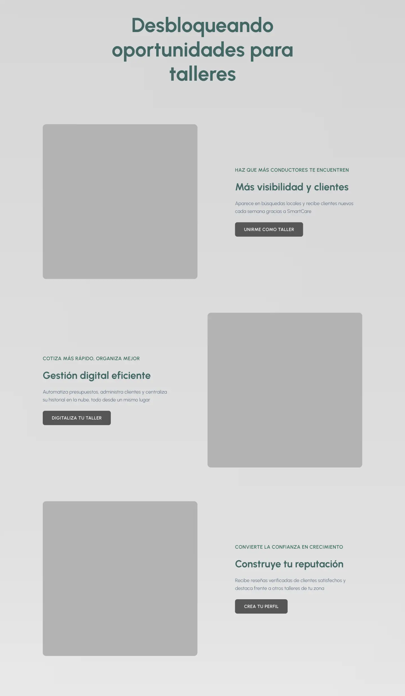

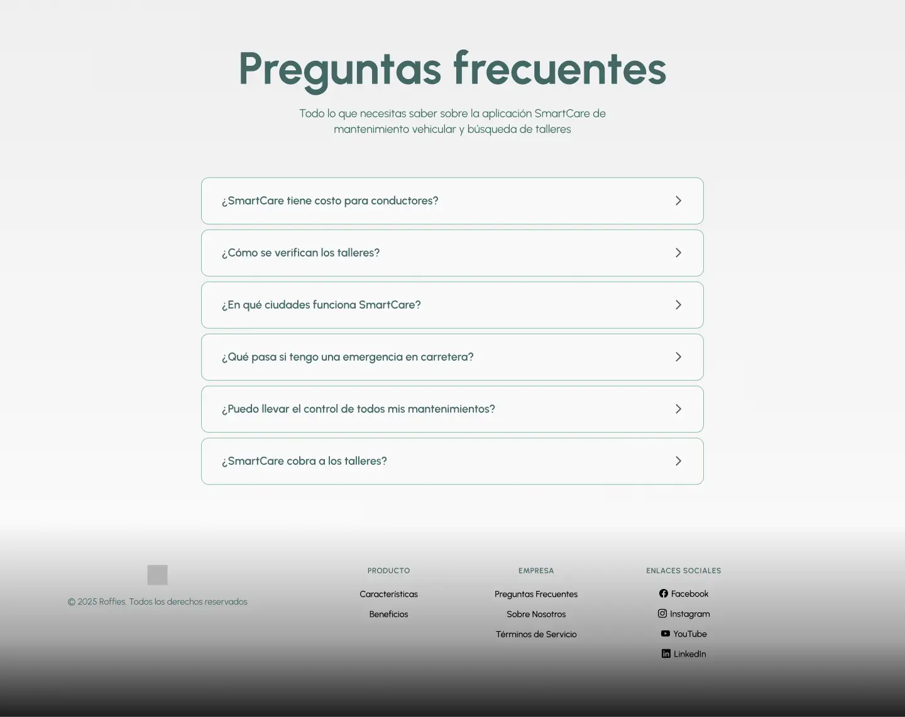

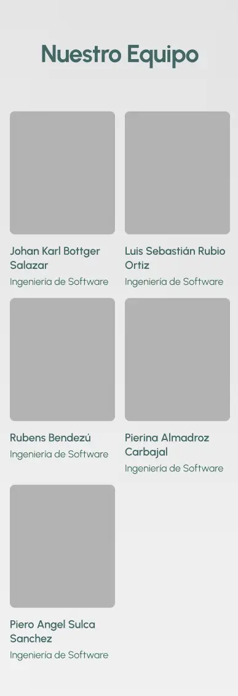

### 4.3.2. Landing Page Mock-up

Aquí se muestran los mock-ups de alta fidelidad diseñados en Figma, donde se aplican la paleta de colores, tipografía e iconografía definidos en las guías de estilo.

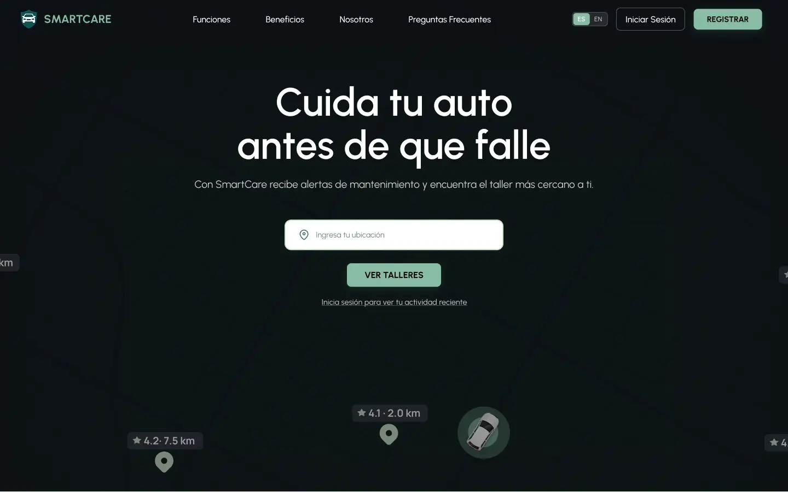

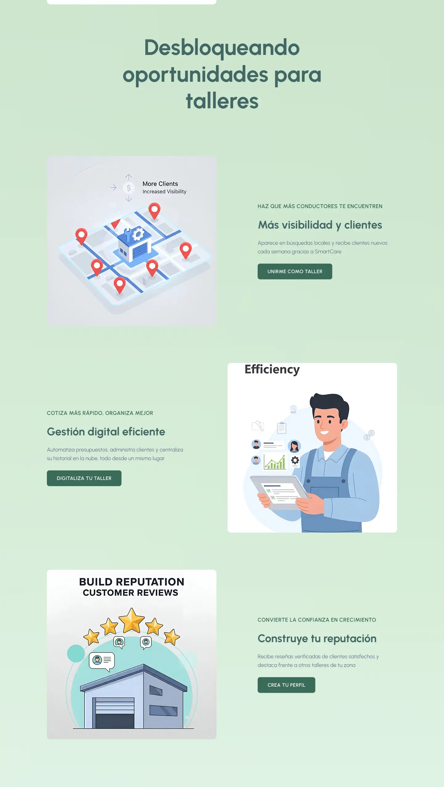

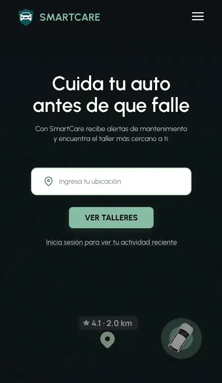

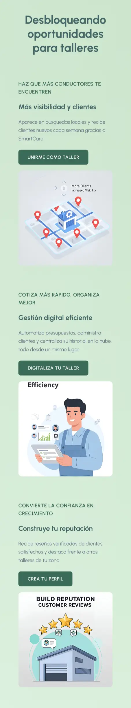

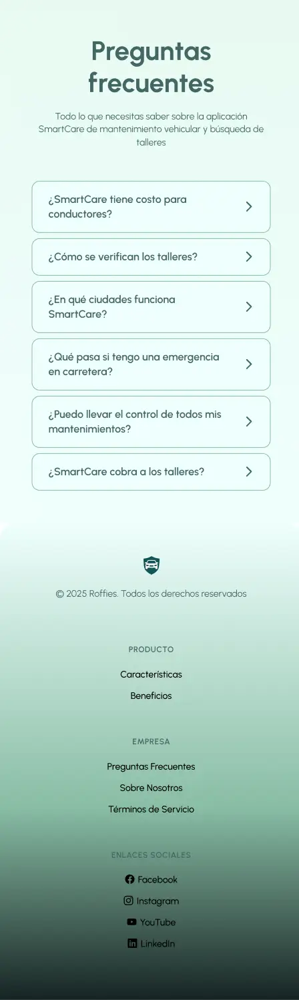

---

# 5.1. Software Configuration Management

A continuación, se presentan las decisiones y convenciones que permitirán mantener la consistencia durante el ciclo de vida.

## 5.1.1. Software Development Environment Configuration
En esta sección se incluyen los links de las aplicaciones y productos de software utilizados durante el ciclo del proyecto **SmartCare**, en los programas que se usaron para colaborar en el desarrollo del producto digital. Para ello se clasifican en las siguientes secciones:

## 5.1.2. Source Code Management

### Project Management
Es la disciplina encargada de la gestión de los proyectos, la cual tiene como objetivo principal mejorar los procesos y su entorno para alcanzar los resultados esperados.  
En el ciclo digital del proyecto se implementará un producto software con un modelo SaaS que se ejecutará a través de un navegador, sin embargo, no se creará una versión de aplicación móvil.

### Requirements Management
Es el proceso de garantizar que una organización documente, verifique y satisfaga las necesidades y expectativas de sus clientes con las partes interesadas internas o externas.  
- **Pivotal Tracker**: Se usó esta herramienta porque organiza bien las user stories y ayuda a mantener el avance del proyecto claro y ordenado.  
  [https://www.pivotaltracker.com/](https://www.pivotaltracker.com/)

### Product UX/UI Design
Estas herramientas permiten desarrollar el modelo de nuestro producto de manera digital y de forma parte de la vida del consumidor. En este caso se realizó un modelo de sitio web.  
- **Uxpressia**: Elaboración de User Persona, Empathy Maps, Journey Maps e Impact Maps.  
  [https://uxpressia.com/](https://uxpressia.com/)  
- **Miro**: Para los As-Is y To-Be Scenario Maps.  
  [https://miro.com/](https://miro.com/)  
- **Figma**: Elaboración de Wireframes, Mock-ups y Prototypes de nuestra Landing Page y Web Application.  
  [https://www.figma.com/](https://www.figma.com/)  
- **Lucidchart**: Elaboración de Wireflows y User Flows.  
  [https://www.lucidchart.com/](https://www.lucidchart.com/)

### Software Development
- **GitHub**: Plataforma utilizada para control de versiones, colaboración y almacenamiento del código fuente del proyecto. Se aplicó GitFlow para mantener un flujo de trabajo ordenado.  
  [https://github.com/](https://github.com/)  
- **HTML**: Estructura del contenido de la Landing Page y vistas principales.  
  [https://developer.mozilla.org/es/docs/Web/HTML](https://developer.mozilla.org/es/docs/Web/HTML)  
- **CSS**: Diseño visual del sitio, respetando Material Design y estilos personalizados.  
  [https://developer.mozilla.org/es/docs/Web/CSS](https://developer.mozilla.org/es/docs/Web/CSS)  
- **JavaScript**: Implementación de lógica del lado del cliente, validaciones, interacciones y consumo de servicios externos.  
  [https://developer.mozilla.org/es/docs/Web/JavaScript](https://developer.mozilla.org/es/docs/Web/JavaScript)

### Software Testing
- **Lenguaje Gherkins**: Para definir criterios de aceptación y escenarios de prueba en lenguaje natural, facilitando la comprensión de desarrolladores y usuarios.  
  [https://profile.es/blog/que-es-gherkin/](https://profile.es/blog/que-es-gherkin/)

### Software Documentation
- **LucidChart**: Diagramas UML y de Base de Datos.  
  [https://www.lucidchart.com/](https://www.lucidchart.com/)  
- **Structurizr**: Documentación de arquitectura bajo modelo C4 (Context, Container, Component, Code).  
  [https://structurizr.com/](https://structurizr.com/)

## 5.1.3. Source Code Style Guide & Conventions
Se adoptaron guías de estilo estándar en inglés para cada lenguaje empleado:  
- HTML/CSS: Google HTML/CSS Style Guide  
- JavaScript: Google JavaScript Style Guide, MDN Guidelines  

Esto asegura legibilidad, coherencia y facilidad de mantenimiento en todo el código del proyecto.

## 5.1.4. Software Deployment Configuration
La gestión del código fuente del proyecto **SmartCare** se realizó utilizando GitHub. Para la publicación y despliegue de la Landing Page, se empleó GitHub Pages, que permite una visualización directa desde el repositorio principal.

Para el desarrollo y despliegue de la Landing Page de **SmartCare** se han utilizado las siguientes herramientas:

- **HTML**: Lenguaje de marcado para estructurar el contenido visual y semántico de la Landing Page (encabezados, párrafos, botones, formularios, etc.).  
- **CSS**: Lenguaje de estilos para dar formato, color, distribución y diseño gráfico, logrando una interfaz atractiva e interactiva.  
- **JavaScript**: Añade interactividad y dinamismo a los componentes de la Landing Page, como validaciones en formularios, navegación fluida y respuestas a eventos del usuario.

https://roffies.github.io/landing-page/

## 5.2 Landing Page, Services & Applications Implementation

### 5.2.1 Sprint 1
Durante este período, nos enfocamos en la implementación de las características y funcionalidades prioritarias identificadas en la planificación inicial. Esto implica traducir los requisitos y especificaciones en código funcional, desarrollando las bases de nuestro producto de manera iterativa.

#### 5.2.1.1 Sprint Planning
En esta sección, se presentará el sprint #1 con la versión inicial del trabajo para la entrega del proyecto, detallando la organización, distribución y evidencia de resultados de la landing page.

| Sprint 1  | Date  | Time  | Location  | Prepared By  | Attendees  |
|---|---|---|---|---|---|
| 1  | 12/9/2025  | 21:00  | Reunión mediante Google Meet  | Luis Sebastián Rubio  | Johan Bottger, Pierina Carbajal, Piero Sulca, Rubens Bendezu |
| Sprint 1 Goal  | Sprint 1 Velocity  | Sum of Story Points  | Aspectos Técnicos  |
|---|---|---|
| Elaborar y diseñar el landing page y documentación inicial para la aplicación ROFFIES | 12  | 12  | HTML5, CSS3, JS, Figma, Vue, Primevue  |

#### 5.2.1.2. Aspect Leaders and Collaborators

#### 5.2.1.3 Sprint Backlog 1
Durante el primer sprint, el equipo se centró en desarrollar una landing page que fuera tanto atractiva como funcional, organizando y distribuyendo tareas en el tablero de Sprint de acuerdo con las habilidades de cada integrante.

####### HU1 Landing Page - Como usuario, quiero una página funcional y atractiva como portada a la aplicación web.
Tsk001 NavBar
Tsk002 Secciones
Tsk003 Login
Tsk004 Signup

#### 5.2.1.4 Development Evidence for Sprint Review
En esta sección se explica y presenta los avances en implementación con relación a los productos de la solución según el alcance del primer Sprint: Landing Page.

A continuación, se presentan los commits más importantes para el Reporte, los cuales muestran el ciclo de vida del proyecto, y toda la información que se usó para el desarrollo del proyecto.

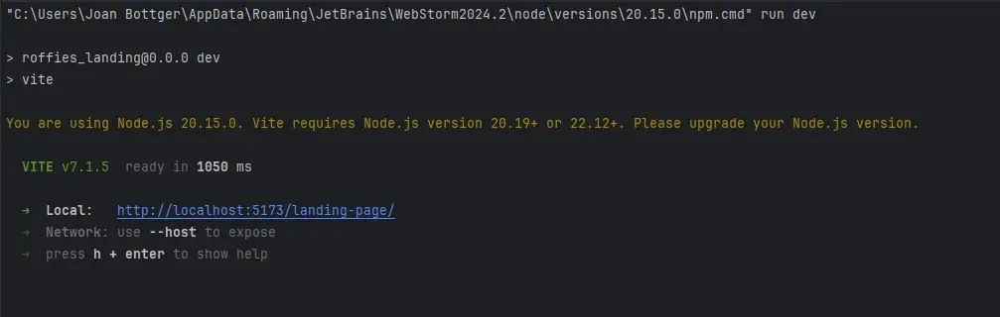

| Repository | Branch | Commit ID | Message | Body | Commit Date  |
|---|---|---|---|---|---|
| Roffies | 12/9/2025  | 21:00  | Reunión mediante Google Meet  |   |   |

#### 5.2.1.5 Testing Suite Evidence for Sprint Review
No aplica a primer sprint y desarrollo de Landing Page.

#### 5.2.1.6 Execution Evidence for Sprint Review
Se incluyen capturas detalladas de la ejecución de la Landing Page de la aplicación como evidencia.
La Landing Page es compuesta por varias secciones que se presentan en las capturas a continuación.

#### 5.2.1. Services Documentation Evidence for Sprint Review
No aplica a primer sprint y desarrollo de Landing Page.

#### 5.2.1.7. Software Deployment Evidence for Sprint Review
Se incluye la evidencia de despliegue del Landing Page en la plataforma Github Pages.

#### 5.2.1.8 Team Collaboration Insights during Sprint
Durante el transcurso de este sprint, todos los miembros participaron de forma activa y constante en la creación de las tareas asignadas. A continuación todos los analíticos que nos proporciona Github, en su apartado de Insights, sobre la colaboración del
equipo durante el Sprint 1:

