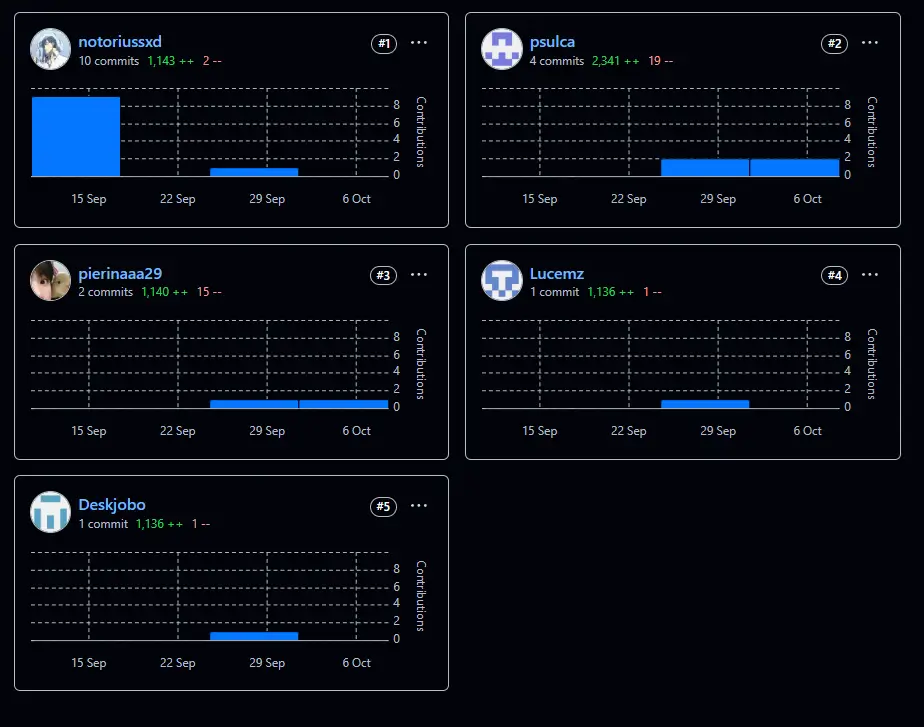
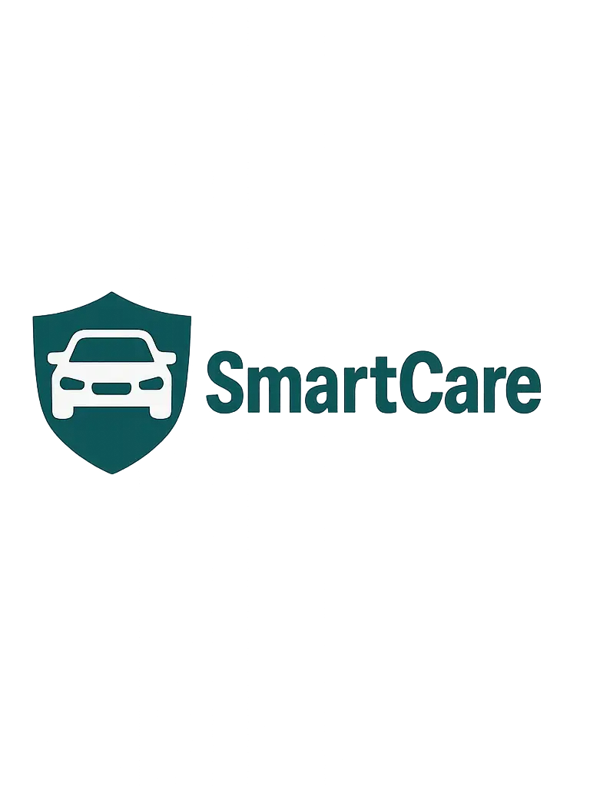
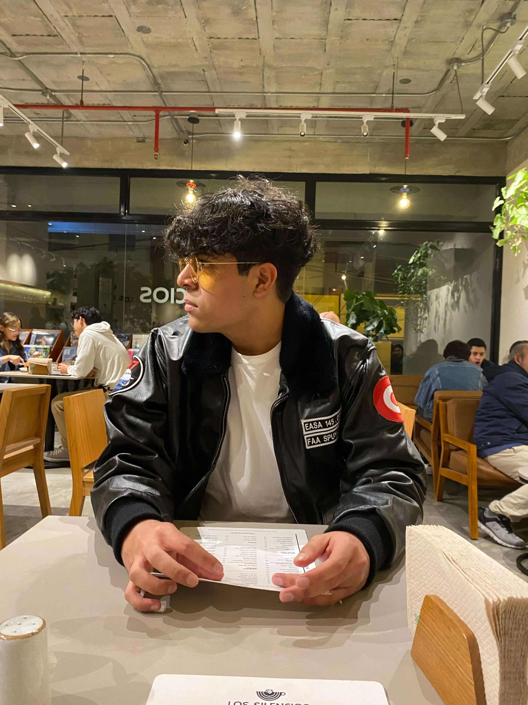
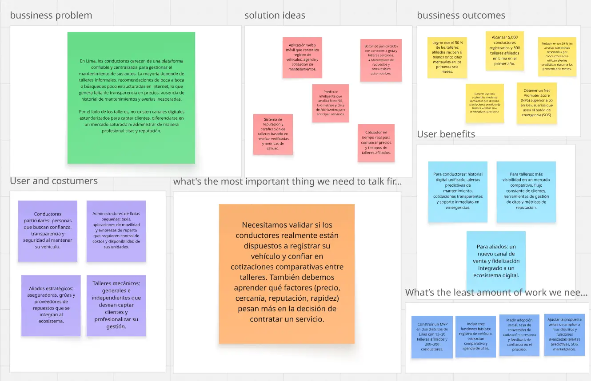

# 
Project Report

    <strong>Universidad Peruana de Ciencias Aplicadas</strong> 
    </img> 
    <strong>Ingeniería de Software - 2025-20</strong> 
    <strong>Aplicaciones Web - 7426</strong> 
    <strong>Profesor: Naldo Reupo-Musayon Gastulo</strong> 
     <strong>Informe del Trabajo Final</strong>

    <strong>Startup: Roffies</strong> 
    <strong>Producto: Smartcare</strong>

    <h3>Team Members:</h3>
    <table align="center">
        <tr>
            <th style="text-align:center;">Member</th>
            <th style="text-align:center;">Code</th>
        </tr>
        <tr>
            <td>Piero Angel Sulca Sánchez</td>
            <td>u202423711</td>
        </tr>
        <tr>
            <td>Johan Karl Bottger Salazar</td>
            <td>u202210735</td>
        </tr>
    </table>

    <strong>Octubre, 2025</strong>

 

<h1 align="center">Registro de versiones del Informe</h1>
 
<table>
      <tr>
        <th>Versión</th>
        <th>Fecha</th>
        <th>Autor</th>
        <th>Descripción de modificaciones</th>
      </tr>
<tr>
  <td>1.0</td>
  <td>18/09/2025</td>
  <td>Equipo: Piero A. Sulca Sánchez; Rúbens Bendezu Navarro; Luis S. Rubio Ortiz; Johan K. Bottger Salazar; Pierina M. Almandroz Carbajal</td>
  <td>Creación y contenido inicial del reporte realizado por el equipo: redacción de secciones principales, perfiles de integrantes y primeros artefactos (diagramas y tablas).</td>
</tr>
<tr>
  <td>2.0</td>
  <td>07/10/2025</td>
  <td>Equipo: Piero A. Sulca Sánchez; Rúbens Bendezu Navarro; Luis S. Rubio Ortiz; Johan K. Bottger Salazar; Pierina M. Almandroz Carbajal</td>
  <td>Actualización del informe realizada por el equipo: corrección de errores, actualización de contenidos, incorporación de evidencias y reestructuración de secciones.</td>
</tr>
</table>

 

# Project Report Collaboration Insights
Link de repositorio del reporte: https://github.com/roffies/upc-pre-202520-1asi0730-7426-roffies-report-tf

## TB1
En esta entrega, cada integrante del equipo participó activamente en el desarrollo del proyecto y en la implementación de la Landing Page, distribuyéndose por secciones de acuerdo con el diseño y contenido previamente definidos. Las capturas de los análisis de colaboración del repositorio oficial reflejan la contribución de todos los miembros.

## TP1
En esta entrega, la colaboración coordinada del equipo hizo posible la implementación de las principales funcionalidades de la aplicación web. La distribución de tareas por secciones, conforme al diseño y contenido establecidos, optimizó el desarrollo. Los registros de colaboración del repositorio oficial demuestran la participación activa de todos los integrantes.

# Contenido
[Student Outcome](#student-outcome)

- [COURSE PROJECT](#course-project)
- [Project Report Collaboration Insights](#project-report-collaboration-insights)
- [Contenido](#contenido)
- [Student Outcome](#student-outcome)
- [Capítulo I: Introducción](#capítulo-i-introducción)
  - [1.1. Startup Profile](#11-startup-profile)
    - [1.1.1. Descripción de la Startup](#111-descripción-de-la-startup)
    - [1.1.2. Perfiles de integrantes del equipo](#112-perfiles-de-integrantes-del-equipo)
  - [1.2. Solution Profile](#12-solution-profile)
    - [1.2.1 Antecedentes y problemática](#121-antecedentes-y-problemática)
    - [1.2.2 Lean UX Process](#122-lean-ux-process)
      - [1.2.2.1. Lean UX Problem Statements](#1221-lean-ux-problem-statements)
      - [1.2.2.2. Lean UX Assumptions](#1222-lean-ux-assumptions)
      - [1.2.2.3. Lean UX Hypothesis Statements](#1223-lean-ux-hypothesis-statements)
      - [1.2.2.4. Lean UX Canvas](#1224-lean-ux-canvas)
  - [1.3. Segmentos objetivo](#13-segmentos-objetivo)
- [Capítulo II: Requirements Elicitation \& Analysis](#capítulo-ii-requirements-elicitation--analysis)
  - [2.1. Competidores](#21-competidores)
    - [2.1.1. Análisis competitivo](#211-análisis-competitivo)
    - [2.1.2. Estrategias y tácticas frente a competidores](#212-estrategias-y-tácticas-frente-a-competidores)
  - [2.2. Entrevistas](#22-entrevistas)
    - [2.2.1. Diseño de entrevistas](#221-diseño-de-entrevistas)
    - [2.2.2. Registro de entrevistas](#222-registro-de-entrevistas)
    - [2.2.3. Análisis de entrevistas](#223-análisis-de-entrevistas)
  - [2.3. Needfinding](#23-needfinding)
    - [2.3.1. User Personas](#231-user-personas)
    - [2.3.2. User Task Matrix](#232-user-task-matrix)
    - [2.3.3. User Journey Mapping](#233-user-journey-mapping)
    - [2.3.4. Empathy Mapping](#234-empathy-mapping)
    - [2.3.5. As-is Scenario Mapping](#235-as-is-scenario-mapping)
  - [2.4. Ubiquitous Language](#24-ubiquitous-language)
- [Capítulo III: Requirements Specification](#capítulo-iii-requirements-specification)
  - [3.1. To-Be Scenario Mapping](#31-to-be-scenario-mapping)
  - [3.2. User Stories](#32-user-stories)
  - [3.3. Impact Mapping](#33-impact-mapping)
  - [3.4. Product Backlog](#34-product-backlog)
- [Capítulo IV: Product Design](#capítulo-iv-product-design)
  - [4.1. Style Guidelines](#41-style-guidelines)
    - [4.1.1. General Style Guidelines](#411-general-style-guidelines)
    - [4.1.2. Web Style Guidelines](#412-web-style-guidelines)
  - [4.2. Information Architecture](#42-information-architecture)
    - [4.2.1. Organization Systems.](#421-organization-systems)
    - [4.2.2. Labeling Systems.](#422-labeling-systems)
    - [4.2.3. SEO Tags and Meta Tags](#423-seo-tags-and-meta-tags)
    - [4.2.4. Searching Systems.](#424-searching-systems)
    - [4.2.5. Navigation Systems.](#425-navigation-systems)
  - [4.3. Landing Page UI Design.](#43-landing-page-ui-design)
    - [4.3.1. Landing Page Wireframe.](#431-landing-page-wireframe)
    - [4.3.2. Landing Page Mock-up.](#432-landing-page-mock-up)
  - [4.4. Web Applications UX/UI Design.](#44-web-applications-uxui-design)
    - [4.4.1. Web Applications Wireframes.](#441-web-applications-wireframes)
    - [4.4.2. Web Applications Wireflow Diagrams.](#442-web-applications-wireflow-diagrams)
    - [4.4.2. Web Applications Mock-ups.](#442-web-applications-mock-ups)
    - [4.4.3. Web Applications User Flow Diagrams.](#443-web-applications-user-flow-diagrams)
  - [4.5. Web Applications Prototyping.](#45-web-applications-prototyping)
  - [4.6. Domain-Driven Software Architecture.](#46-domain-driven-software-architecture)
    - [4.6.1. Software Architecture Context Diagram.](#461-software-architecture-context-diagram)
    - [4.6.2. Software Architecture Container Diagrams.](#462-software-architecture-container-diagrams)
    - [4.6.3. Software Architecture Components Diagrams.](#463-software-architecture-components-diagrams)
  - [4.7. Software Object-Oriented Design.](#47-software-object-oriented-design)
    - [4.7.1. Class Diagrams.](#471-class-diagrams)
    - [4.7.2. Class Dictionary.](#472-class-dictionary)
  - [4.8. Database Design.](#48-database-design)
    - [4.8.1. Database Diagram.](#481-database-diagram)
- [Capítulo V: Product Implementation, Validation \& Deployment](#capítulo-v-product-implementation-validation--deployment)
  - [5.1. Software Configuration Management.](#51-software-configuration-management)
    - [5.1.1. Software Development Environment Configuration.](#511-software-development-environment-configuration)
    - [5.1.2. Source Code Management.](#512-source-code-management)
    - [5.1.3. Source Code Style Guide \& Conventions.](#513-source-code-style-guide--conventions)
    - [5.1.4. Software Deployment Configuration.](#514-software-deployment-configuration)
  - [5.2. Landing Page, Services \& Applications Implementation](#52-landing-page-services--applications-implementation)
    - [5.2.1. Sprint 1](#521-sprint-1)
      - [5.2.1.1. Sprint Planning 1](#5211-sprint-planning-1)
      - [5.2.1.2. Aspect Leaders and Collaborators.](#5212-aspect-leaders-and-collaborators)
      - [5.2.1.3. Sprint Backlog 1.](#5213-sprint-backlog-n)
      - [5.2.1.4. Development Evidence for Sprint Review.](#5214-development-evidence-for-sprint-review)
      - [5.2.1.5. Execution Evidence for Sprint Review.](#5215-execution-evidence-for-sprint-review)
      - [5.2.1.6. Services Documentation Evidence for Sprint Review.](#5216-services-documentation-evidence-for-sprint-review)
      - [5.2.1.7. Software Deployment Evidence for Sprint Review.](#5217-software-deployment-evidence-for-sprint-review)
      - [5.2.1.8. Team Collaboration Insights during Sprint.](#5218-team-collaboration-insights-during-sprint)

    - [5.2.2. Sprint 2](#522-sprint-2)
      - [5.2.2.1. Sprint Planning 2](#5221-sprint-planning-2)
      - [5.2.2.2. Aspect Leaders and Collaborators.](#5222-aspect-leaders-and-collaborators)
      - [5.2.2.3. Sprint Backlog 2.](#5223-sprint-backlog-2)
      - [5.2.2.4. Development Evidence for Sprint Review.](#5224-development-evidence-for-sprint-review)
      - [5.2.2.5. Execution Evidence for Sprint Review.](#5225-execution-evidence-for-sprint-review)
      - [5.2.2.6. Services Documentation Evidence for Sprint Review.](#5226-services-documentation-evidence-for-sprint-review)
      - [5.2.2.7. Software Deployment Evidence for Sprint Review.](#5227-software-deployment-evidence-for-sprint-review)
      - [5.2.2.8. Team Collaboration Insights during Sprint.](#5228-team-collaboration-insights-during-sprint)

- [Conclusiones](#conclusiones)
  - [Conclusiones y recomendaciones.](#conclusiones-y-recomendaciones)
- [Bibliografía](#bibliografía)
- [Anexos](#anexos)

---

# Student Outcome

ABET – EAC - Student Outcome 5

**Criterio:**  Capacidad de comunicarse efectivamente con un rango de audiencias.

<table>
  <tr>
    <td><b>Criterio específico</b></td>
    <td><b>Acciones realizadas</b></td>
    <td><b>Conclusiones</b></td>
  </tr>
    </thead>
  <tbody>
    <tr>
      <td><b>Comunica oralmente con efectividad a diferentes rangos de audiencia.</b></td>
      <td>
        
<b>Piero Angel Sulca Sánchez</b>

        
<b>TB1:</b>

        
Durante la primera entrega, participé en la exposición del Capítulo 3 – Requirements Specification. Expliqué la relación entre los artefactos de diseño —como el To-Be Scenario Mapping, las User Stories, el Impact Mapping y el Product Backlog—, y cómo estos se conectaban con los objetivos del Lean UX Canvas. Utilicé un lenguaje técnico con mi equipo y uno más visual y funcional al exponer ante los docentes, buscando siempre una comunicación clara y adaptada al público.

        
<b>TP1:</b>

        
En el segundo avance, lideré la sustentación de las correcciones del informe y la presentación del Frontend base de la aplicación. Expliqué las mejoras en la arquitectura de componentes y la actualización de la Landing Page, justificando las decisiones visuales y estructurales. Mi comunicación oral fue clave para evidenciar la coherencia entre la documentación, la interfaz y la lógica técnica del sistema.

                  
        
<b>Rúbens Bendezu Navarro</b>

        
<b>TB1:</b>

        
Me encargué de exponer el Capítulo 4 – Product Design, presentando las bases del diseño visual y la arquitectura de información del sistema. Expliqué la relación entre las Style Guidelines y el prototipo inicial, mostrando cómo las decisiones de diseño se alineaban con los requerimientos funcionales del proyecto.

        
<b>TP1:</b>

        

                    
        
<b>Johan Karl Bottger Salazar</b>

        
<b>TB1:</b>

        
Expliqué el Capítulo 1 – Startup Profile & Solution Profile y la primera versión de la Landing Page. Mostré la propuesta de valor y los objetivos del proyecto, conectando los fundamentos del modelo de negocio con la experiencia del usuario dentro de la aplicación.

        
<b>TP1:</b>

        
En está entrega realizé gran parte del desarrollo del front end application siguiendo la propuesta de valor y los objetivos del proyecto establecidos.

        
<b>Luis Sebastián Rubio Ortiz</b>

        
<b>TB1:</b>

        
Expuse el Capítulo 2 – Requirements Elicitation & Analysis, presentando los hallazgos de las entrevistas y el análisis de competidores. Detallé cómo esta información fundamentó la definición de los usuarios y las funcionalidades de la aplicación.

        
<b>TP1:</b>

        

        

                    
        
<b>Pierina Marysabel Almandroz Carbajal</b>

        
<b>TB1:</b>

        
Presenté el Capítulo 5 – Product Implementation, Validation & Deployment, explicando la estructura inicial de validación y despliegue del sistema. Destaqué la importancia de conectar los avances técnicos con los objetivos de desarrollo propuestos para SmartCare.

        
<b>TP1:</b>

        

      </td>
       
      <td>
        
<b>TB1:</b>

        
Como equipo, logramos una comunicación oral clara, organizada y adaptada a cada público. Cada integrante asumió la exposición de su capítulo con dominio del tema, lo que permitió mostrar una comprensión integral del proyecto SmartCare.

        
<b>TP1:</b>

        
En este avance, mejoramos notablemente la comunicación oral. Las presentaciones sobre las correcciones, la Landing Page y el Frontend base demostraron claridad, dominio técnico y una coordinación efectiva entre todos los miembros del grupo.

           
      </td>
      </tr>
      <tr>
      <td>Comunica por escrito con efectividad a diferentes rangos de audiencia</td>
      <td>
        
<b>Piero Ángel Sulca Sánchez</b>

        
<b>TB1:</b>

        
Redacté el Capítulo 3, describiendo con detalle los artefactos de especificación de requisitos: Scenario Mapping, User Stories, Impact Mapping y Product Backlog. Utilicé un lenguaje técnico claro y coherente, lo que facilitó la comprensión del enfoque ágil dentro del documento.

        
<b>TP1:</b>

        
Me encargué de revisar y corregir el informe completo, unificando el estilo de redacción y aplicando las observaciones docentes. También actualicé el contenido de la Landing Page en el repositorio e implementé la base del Frontend, dejando evidencia escrita mediante commits descriptivos y ordenados.

                    
        
<b>Rúbens Bendezu Navarro</b>

        
<b>TB1:</b>

        
Redacté el Capítulo 4, documentando los lineamientos de diseño visual y la arquitectura de información. Cuidé que la redacción mantuviera coherencia estética y funcional, registrando las decisiones de diseño y estilo aplicadas al sistema.

        
<b>TP1:</b>

        

                 
        
<b>Johan Karl Bottger Salazar</b>

        
<b>TB1:</b>

        
Redacté el Capítulo 1, comunicando el perfil de la startup, la problemática abordada y los objetivos del proyecto. Procuré una escritura clara y ordenada que sirviera como base conceptual del trabajo.

        
<b>TP1:</b>

        
Documenté efectivamente el desarrollo del Sprint 2. Asegurando la validez de la información en una estructura ordenada y clara, en relación con la base teórica del proyecto.

                    
        
<b>Luis Sebastián Rubio Ortiz</b>

       
<b>TB1:</b>

        
Escribí el Capítulo 2, donde documenté el análisis de usuarios y competidores. Me aseguré de mantener una redacción estructurada y analítica que reflejara los fundamentos de las decisiones de diseño y desarrollo.

        
<b>TP1:</b>

        

                  
        
<b>Pierina Marysabel Almandroz Carbajal</b>

       
<b>TB1:</b>

        
Elaboré el Capítulo 5, detallando la implementación técnica, la validación funcional y los lineamientos de despliegue del sistema. Mantuvé una redacción técnica, clara y organizada, lo que permitió una mejor comprensión de los aspectos operativos del proyecto.

        
<b>TP1:</b>

        

      </td>   
      <td>
       
<b>TB1:</b>

        
Como grupo, logramos una comunicación escrita clara, estructurada y coherente entre capítulos. Cada uno mantuvo un estilo técnico uniforme, lo que permitió entregar un informe sólido y alineado con los objetivos del curso.

        
<b>TP1:</b>

        
En este avance, consolidamos la redacción y documentación del proyecto a través de las correcciones y la actualización de la Landing Page. Estas mejoras reflejaron una comunicación escrita más madura y técnica, evidenciando orden, precisión y consistencia en los registros del trabajo.

      </td>
    </tr>
  </tbody>
</table>

# **Capítulo I: Introducción**

## 1.1. Startup Profile
 En esta sección se presenta la descripción del startup y los perfiles de los miembros del equipo.

### 1.1.1. Descripción de la Startup
Roffies es una startup tecnológica enfocada en modernizar el mantenimiento automotriz en Lima y, progresivamente, en todo el país. Nuestro producto principal, SmartCare, es una plataforma web que centraliza la afiliación de talleres mecánicos (especializados por marca y generales) y conecta a dueños de vehículos con servicios confiables para programar citas, recibir alertas y cotizar trabajos en tiempo real.

La propuesta de valor de Roffies se basa en analizar el historial de vehículos, el kilometraje y la data técnica de fabricantes para estimar costos, sugerir servicios preventivos y anticipar necesidades antes de que se conviertan en averías. Con ello buscamos reducir gastos inesperados, mejorar la seguridad vial y aumentar la transparencia de precios y diagnósticos.

El sistema consiste en un historial digital de mantenimientos, alertas de mantenimiento basadas en datos por marca y uso, cotizador en tiempo real entre talleres afiliados, botón de pánico para averías en ruta, conexión directa con grúas y derivación automática al taller más cercano con disponibilidad. 

- **Misión:** transformar la experiencia de mantenimiento vehicular en el Perú mediante tecnología predictiva, datos confiables y una red de talleres de calidad, entregando al conductor control y tranquilidad, y al taller, eficiencia y clientes fieles.

- **Visión:** ser la plataforma líder a nivel nacional en servicios automotrices digitales, reconocida por prevenir averías, profesionalizar la relación taller–cliente y elevar el estándar del servicio mecánico en el Perú.

**Logotipo del servicio**

### 1.1.2. Perfiles de integrantes del equipo

|                                             **Integrantes**                                              |                                                                                                                                                                                            **Descripción del Perfil**                                                                                                                                                                                            |
| :------------------------------------------------------------------------------------------------------: | :--------------------------------------------------------------------------------------------------------------------------------------------------------------------------------------------------------------------------------------------------------------------------------------------------------------------------------------------------------------------------------------------------------------: |
| **Piero Angel Sulca Sanchez(U202423711)**  | 
Me llamo Piero Angel Sulca Sanchez, soy estudiante de Ingeniería de Software. Me gusta trabajar en equipo pues me permite aprender sobre las ideas que tienen los participantes y contrastarlas con las mías para poder seguir mejorando. Tengo conocimiento en tecnologías de desarrollo web como TypeScript, React, Next.js y NestJS. Estoy muy interesado en el desarrollo de aplicaciones web.
 |
|                     **Rúbens Bendezu Navarro (U20231d390)**                      |          
Me llamo Rúbens Bendezu Navarro, soy estudiante de Ingeniería de Software. Me considero una persona motivada por el aprendizaje continuo y el trabajo en equipo, ya que compartir ideas y experiencias enriquece tanto el desarrollo personal como el profesional. Tengo conocimientos en tecnologías de desarrollo web y frameworks modernos, y me interesa especialmente el desarrollo de aplicaciones web que aporten soluciones innovadoras y de impacto.
                                                                                                                                                                                                                                                                                                                                                                                                         |
|                     **Luis Sebastián Rubio Ortiz (U202310349)**                      | 
Me llamo Luis Sebastián Rubio ortiz, soy estudiante de Ingeniería de Software y actualmente estoy cursando el quinto ciclo. Considero que soy una persona responsable, me gusta aprender cosas nuevas constantemente y me gusta apoyar a mis compañeros con cualquier cosa que necesiten.
 |
|                     **Johan Karl Bottger Salazar (u202210735)**                      |  
Soy Johan Karl Bottger Salazar, y soy estudiante de Ingeniería de Software. Tengo mucho interés en las metodologías ágiles y me gustaría especializarme en ello.
                                                                                                                                                                                                                                                                                                                                                                                                                |
|                     **Pierina Marysabel Almandroz Carbajal (U202316845)**                      |  Soy Pierina, tengo 19 años, soy estudiante de 5to ciclo de Ing. de Software. Me encuentro comprometida con el grupo y tengo un gran interés en el desarrollo de aplicaciones web, área en la que busco seguir especializándome.                                                                                                                                                                                                                                                                                                                                                                                                                |

## 1.2. Solution Profile

### 1.2.1. Antecedentes y problemática

Lima concentra una porción significativa del parque automotor del país y la demanda por servicios de mantenimiento crece de forma sostenida. La Asociación Automotriz del Perú (AAP) difunde mensualmente estadísticas del sector, mostrando evolución de ventas e inmatriculaciones, un contexto que empuja la necesidad de profesionalizar y digitalizar la posventa (mecánica, repuestos, auxilio) 
Por otro lado, la seguridad vial y la atención de emergencias son temas críticos: el Observatorio Nacional de Seguridad Vial reportó en 2023 más de 87 mil siniestros, con miles de personas lesionadas o fallecidas; ello refuerza la importancia de un botón de auxilio y derivación rápida a grúa y taller.

**What**
**¿Cuál es el problema?**
Los conductores carecen de una plataforma confiable y transparente para gestionar el mantenimiento de su vehículo, comparar precios, registrar historial y recibir alertas preventivas; los talleres, a su vez, no cuentan con herramientas estandarizadas para captar y fidelizar clientes con métricas de calidad.

**When**
**¿Cuándo sucede el problema?**
Durante todo el ciclo de vida del vehículo: mantenimientos preventivos por kilometraje/tiempo, reparaciones correctivas, pre–ITV, y emergencias en ruta.

**Where**
**¿Dónde surge el problema?**
Inicialmente en Lima Metropolitana, con expansión nacional planificada a partir de tracción en ejes urbanos regionales.

**Who**
**¿Quiénes están involucrados? ¿Quién lo utilizará?**
Conductores de autos particulares y pequeñas flotas, talleres mecánicos afiliados (generales y especialistas), empresas de grúas y, como aliados, aseguradoras y distribuidores de repuestos.

**Why**
**¿Por qué? ¿Cuál es la causa del problema?**
Informalidad y heterogeneidad de estándares de servicio, ausencia de historial centralizado, baja transparencia de precios y escaso uso de datos para la prevención.

**¿Cuáles son las 2H?**

**How (Cómo)**
**¿Cómo se utilizará el producto?**
El conductor registra su vehículo, recibe alertas de mantenimiento, cotiza y agenda con talleres verificados; el taller gestiona disponibilidad, precios, reputación y reporta trabajos a un historial único. En emergencias, el usuario activa SOS para conexión inmediata con grúa y derivación al taller más cercano disponible.

**How much (Cuánto)**
**¿Cuál es la magnitud del problema?**
El tamaño del mercado puede inferirse por la masa vehicular y su gasto recurrente en mantenimiento y reparación; la publicación periódica de la AAP sobre ventas y el crecimiento de líneas móviles sugieren condiciones atractivas para una plataforma de servicios posventa escalable.

## 1.2.2. Lean UX Process

### 1.2.2.1. Lean UX Problem Statements

**Problem Statement**

En Lima, los conductores enfrentan una constante incertidumbre respecto al cuidado de sus vehículos. No cuentan con información clara ni centralizada sobre qué mantenimiento requiere su auto, en qué momento debe realizarlo ni cuánto debería costar. En la práctica, la mayoría elige talleres en función de la cercanía geográfica o recomendaciones informales, lo que los expone a diagnósticos poco transparentes, precios dispares e incluso a reparaciones innecesarias. Esta falta de estandarización deriva en averías que podrían haberse prevenido, incrementando los riesgos de seguridad en ruta y generando gastos inesperados que afectan directamente al bolsillo del usuario.

Del otro lado, los talleres mecánicos, especialmente los independientes, carecen de herramientas digitales que les permitan diferenciarse en un mercado cada vez más competitivo. Muchos no pueden visibilizar adecuadamente su propuesta de valor, gestionar agendas de manera eficiente ni consolidar una reputación verificable basada en la experiencia real de los clientes. Como resultado, pierden oportunidades de fidelización y de captar nuevos usuarios que buscan confianza y profesionalismo.

Esta brecha estructural entre oferta y demanda, sin un historial único del vehículo ni alertas de mantenimiento basadas en datos concretos; genera sobrecostos, tiempos muertos y pérdidas de productividad para los usuarios. Al mismo tiempo, limita el crecimiento y formalización de los talleres, perpetuando un ecosistema fragmentado, poco transparente y vulnerable a la desconfianza. Resolver esta problemática no solo representa una oportunidad de innovación tecnológica, sino también una contribución a la seguridad vial y a la modernización del sector automotriz en el Perú.

### 1.2.2.2. Lean UX Assumptions

**Business Assumptions**

- Creemos que nuestros usuarios necesitan una forma más confiable, rápida y basada en datos para conectar sus vehículos privados con talleres mecánicos especializados y generales.
- Estas necesidades pueden satisfacerse con una plataforma web que afilie talleres confiables, gestione historiales digitales y emita alertas predictivas de mantenimiento.
- Nuestros primeros clientes serán propietarios de vehículos privados en Lima Metropolitana que buscan conservar sus autos en buen estado y acceder a precios transparentes.
- El valor más importante que un cliente quiere es llevar el historial de su vehículo, recibir alertas de mantenimiento, comparar precios en tiempo real y contar con un botón de pánico en emergencias.
- Los clientes también obtendrán tranquilidad por tener sus datos centralizados y los talleres ganarán visibilidad digital y más clientes.
- Vamos a adquirir la mayoría de clientes mediante alianzas estratégicas, marketing digital y colaboraciones con aseguradoras y empresas de movilidad.
- Obtendremos ingresos por comisión en transacciones, suscripciones premium para talleres y márgenes en un marketplace de productos automotrices.
- Nuestra competencia directa incluye aplicaciones de aseguradoras y directorios en línea, pero ninguno ofrece un ecosistema integral con historial digital y predictor inteligente.
- Nuestra ventaja competitiva es que Roffies no solo conecta talleres y conductores, sino que ofrece un sistema integral con datos predictivos, historial exclusivo y soporte en emergencias.
  
- El mayor riesgo es que talleres tradicionales no adopten la herramienta y que conductores desconfíen de los talleres afiliados al inicio.
- Este riesgo se mitigará con una interfaz amigable, procesos claros y casos de éxito que validen los resultados.

**User Assumptions**

**¿Quién es el usuario?**

Nuestros usuarios principales son los dueños de vehículos particulares que circulan en Lima Metropolitana y desean una forma práctica de cuidar su vehículo sin gastar de más. En paralelo, los talleres mecánicos afiliados son usuarios claves de la plataforma, ya que gestionarán su reputación, agenda y relación con clientes a través de Roffies.

**¿Qué problemas tiene nuestro usuario que el producto debe resolver?**

- Los conductores enfrentan dificultad para encontrar talleres confiables y no tienen una forma estandarizada de comparar precios y servicios.
- Carecen de un historial centralizado que muestre mantenimientos pasados, lo que genera diagnósticos poco precisos y repetición de trabajos.
- Están expuestos a averías en ruta por no contar con alertas de mantenimiento preventivo.
- Los talleres, en cambio, tienen problemas para captar clientes en un mercado saturado, no cuentan con herramientas de visibilidad digital ni sistemas modernos de gestión.

**¿Qué características son importantes?**

Los usuarios valoran funcionalidades como:

- Registro del vehículo y mantenimiento de un historial digitalizado.
- Alertas predictivas basadas en kilometraje y datos de fabricantes.
- Cotizador en tiempo real con comparación entre talleres afiliados.
- Botón de emergencia para asistencia en ruta.
- Agenda online y pago digital seguro.
- Reputación verificable de talleres basada en reseñas de clientes y métricas de desempeño.

**¿Dónde encaja el producto en su trabajo o vida diaria?**

La plataforma se convierte en parte de la rutina de gestión del vehículo. Para los conductores, Roffies actúa como un “asistente digital automotriz” que les recuerda cuándo y dónde realizar mantenimientos. Para talleres, se integra como su agenda principal de gestión, reemplazando procesos manuales de registro de citas.

**¿Cuándo y cómo se usará el producto?**

El producto se usará en distintos momentos críticos:
- Antes de un mantenimiento programado, cuando la plataforma envía alertas predictivas.
- Durante la comparación de precios, cuando el conductor busca transparencia y ahorro.
- En emergencias, con el uso del botón de pánico y la conexión con grúa.
- En la administración diaria de talleres, al gestionar clientes, citas y métricas.

**¿Cómo debe verse y comportarse el producto?**

Debe tener una interfaz moderna, confiable e intuitiva, diseñada para un público amplio, desde jóvenes usuarios digitales hasta conductores de mayor edad. La experiencia debe transmitir seguridad, simplicidad y transparencia. El sistema debe proteger datos sensibles, garantizar disponibilidad 24/7 y permitir personalización de acuerdo al perfil del usuario (conductor o taller).

**Future Assumptions** 

- **Creemos que** la plataforma debe evolucionar hacia la integración con IoT y telemática, permitiendo que los vehículos conectados envíen datos automáticos a Roffies para generar alertas sin intervención manual.
- **Creemos que** debe incluir inteligencia artificial para sugerir mantenimientos no solo basados en kilometraje, sino también en patrones de uso y estilo de conducción.
- **Creemos que** debe contar con un sistema de reputación sólido para talleres, con badges de calidad y certificaciones verificables.
- **Creemos que** debe integrarse con aseguradoras para ofrecer seguros personalizados según historial de mantenimiento.
- **Creemos que** debe tener dashboards visuales de métricas para conductores (ahorro, historial, proyecciones) y para talleres (clientes atendidos, ingresos, eficiencia).
- **Creemos que** a futuro se expandirá con servicios adicionales: compra-venta de vehículos usados con historial certificado, financiamiento de reparaciones y alianzas con fabricantes para garantías extendidas.

---

### 1.2.2.3. Lean UX Hypothesis Statements

#### Hypothesis Statement 01

Creemos que los conductores en Lima Metropolitana estarán dispuestos a registrar sus vehículos en Roffies para recibir alertas de mantenimiento predictivas, historial digital y cotizaciones claras entre talleres afiliados.

Sabremos que hemos tenido éxito

Cuando al menos el 60 % de los usuarios que descarguen la aplicación completen el registro de su vehículo y generen al menos una cotización en los primeros 15 días de uso.

#### Hypothesis Statement 02

Creemos que los talleres mecánicos (especializados y generales) estarán interesados en afiliarse a Roffies para aumentar su visibilidad digital, captar clientes nuevos y mejorar su reputación con reseñas verificadas.

Sabremos que hemos tenido éxito

Cuando al menos el 40 % de los talleres afiliados reciban cinco o más reservas mensuales en los primeros tres meses de uso de la plataforma.

#### Hypothesis Statement 03

Creemos que la integración del botón de emergencia (SOS) que conecta al conductor con grúas y talleres cercanos incrementará significativamente la confianza y satisfacción de los usuarios.

Sabremos que hemos tenido éxito

Cuando al menos el 30 % de los conductores activos utilice el botón SOS al menos una vez durante el primer año y reportan una satisfacción superior al 70 % en encuestas posteriores al servicio.

#### Hypothesis Statement 04

Creemos que el predictor de mantenimiento reducirá las averías correctivas inesperadas al anticipar servicios preventivos basados en historial y kilometraje.

Sabremos que hemos tenido éxito

Cuando al menos el 25 % de los conductores que utilicen la función de alertas predictivas registran una reducción en sus averías correctivas en un periodo de seis meses, en comparación con usuarios que no activen esta función.

#### 1.2.2.4. Lean UX Canvas

link en miro: https://miro.com/app/board/uXjVJ-y_4UE=/ 

## 1.3. Segmentos objetivo
**Conductores de vehículos particulares**

Este segmento incluye a propietarios de automóviles particulares. De acuerdo con la Asociación Automotriz del Perú (AAP), en 2023 el parque automotor peruano superó los 3,5 millones de vehículos, de los cuales más del 65 % se concentran en Lima y Callao (AAP, 2023). Este crecimiento constante genera una demanda creciente de servicios de mantenimiento y reparación. Sin embargo, los conductores enfrentan problemas de informalidad en talleres, sobrecostos y ausencia de historiales de servicio digitalizados, lo que afecta la seguridad y la eficiencia del uso de sus vehículos.
Para este grupo, Roffies ofrece beneficios como la centralización del historial de mantenimientos, alertas predictivas basadas en kilometraje y data de fabricantes, cotizaciones transparentes entre talleres y un botón de emergencia para asistencia inmediata en ruta. Estos atributos incrementan la confianza, reducen costos imprevistos y mejoran la seguridad vial en una ciudad con altos índices de congestión y accidentes.

**Talleres mecánicos afiliados (generales y especializados)**

El segundo segmento lo conforman talleres mecánicos independientes y especializados que operan en Lima Metropolitana. Según datos del Instituto Nacional de Estadística e Informática (INEI), más del 70 % de los talleres automotrices en el Perú son micro y pequeñas empresas (MYPEs), con un alto nivel de informalidad y escasa digitalización (INEI, 2022). La mayoría carece de herramientas tecnológicas para gestionar clientes, mejorar su reputación y competir en un mercado cada vez más exigente.
Para los talleres, Roffies representa una oportunidad de transformación digital: visibilidad en un marketplace confiable, captación de clientes nuevos sin altos costos de publicidad, sistema de reputación con reseñas verificadas y herramientas para gestionar agendas y métricas de desempeño. Al integrarse en la plataforma, los talleres pueden diferenciarse de la competencia, fidelizar clientes y aumentar sus ingresos.
