# 5.1. Software Configuration Management

A continuación, se presentan las decisiones y convenciones que permitirán mantener la consistencia durante el ciclo de vida.

## 5.1.1. Software Development Environment Configuration
En esta sección se incluyen los links de las aplicaciones y productos de software utilizados durante el ciclo del proyecto **SmartCare**, en los programas que se usaron para colaborar en el desarrollo del producto digital. Para ello se clasifican en las siguientes secciones:

## 5.1.2. Source Code Management

### Project Management
Es la disciplina encargada de la gestión de los proyectos, la cual tiene como objetivo principal mejorar los procesos y su entorno para alcanzar los resultados esperados.  
En el ciclo digital del proyecto se implementará un producto software con un modelo SaaS que se ejecutará a través de un navegador, sin embargo, no se creará una versión de aplicación móvil.

### Requirements Management
Es el proceso de garantizar que una organización documente, verifique y satisfaga las necesidades y expectativas de sus clientes con las partes interesadas internas o externas.  
- **Pivotal Tracker**: Se usó esta herramienta porque organiza bien las user stories y ayuda a mantener el avance del proyecto claro y ordenado.  
  [https://www.pivotaltracker.com/](https://www.pivotaltracker.com/)

### Product UX/UI Design
Estas herramientas permiten desarrollar el modelo de nuestro producto de manera digital y de forma parte de la vida del consumidor. En este caso se realizó un modelo de sitio web.  
- **Uxpressia**: Elaboración de User Persona, Empathy Maps, Journey Maps e Impact Maps.  
  [https://uxpressia.com/](https://uxpressia.com/)  
- **Miro**: Para los As-Is y To-Be Scenario Maps.  
  [https://miro.com/](https://miro.com/)  
- **Figma**: Elaboración de Wireframes, Mock-ups y Prototypes de nuestra Landing Page y Web Application.  
  [https://www.figma.com/](https://www.figma.com/)  
- **Lucidchart**: Elaboración de Wireflows y User Flows.  
  [https://www.lucidchart.com/](https://www.lucidchart.com/)

### Software Development
- **GitHub**: Plataforma utilizada para control de versiones, colaboración y almacenamiento del código fuente del proyecto. Se aplicó GitFlow para mantener un flujo de trabajo ordenado.  
  [https://github.com/](https://github.com/)  
- **HTML**: Estructura del contenido de la Landing Page y vistas principales.  
  [https://developer.mozilla.org/es/docs/Web/HTML](https://developer.mozilla.org/es/docs/Web/HTML)  
- **CSS**: Diseño visual del sitio, respetando Material Design y estilos personalizados.  
  [https://developer.mozilla.org/es/docs/Web/CSS](https://developer.mozilla.org/es/docs/Web/CSS)  
- **JavaScript**: Implementación de lógica del lado del cliente, validaciones, interacciones y consumo de servicios externos.  
  [https://developer.mozilla.org/es/docs/Web/JavaScript](https://developer.mozilla.org/es/docs/Web/JavaScript)

### Software Testing
- **Lenguaje Gherkins**: Para definir criterios de aceptación y escenarios de prueba en lenguaje natural, facilitando la comprensión de desarrolladores y usuarios.  
  [https://profile.es/blog/que-es-gherkin/](https://profile.es/blog/que-es-gherkin/)

### Software Documentation
- **LucidChart**: Diagramas UML y de Base de Datos.  
  [https://www.lucidchart.com/](https://www.lucidchart.com/)  
- **Structurizr**: Documentación de arquitectura bajo modelo C4 (Context, Container, Component, Code).  
  [https://structurizr.com/](https://structurizr.com/)

## 5.1.3. Source Code Style Guide & Conventions
Se adoptaron guías de estilo estándar en inglés para cada lenguaje empleado:  
- HTML/CSS: Google HTML/CSS Style Guide  
- JavaScript: Google JavaScript Style Guide, MDN Guidelines  

Esto asegura legibilidad, coherencia y facilidad de mantenimiento en todo el código del proyecto.

## 5.1.4. Software Deployment Configuration
La gestión del código fuente del proyecto **SmartCare** se realizó utilizando GitHub. Para la publicación y despliegue de la Landing Page, se empleó el servicio de Vercel, que permite una visualización directa desde el repositorio principal.

Para el desarrollo y despliegue de la Landing Page de **SmartCare** se han utilizado las siguientes herramientas:

- **HTML**: Lenguaje de marcado para estructurar el contenido visual y semántico de la Landing Page (encabezados, párrafos, botones, formularios, etc.).  
- **CSS**: Lenguaje de estilos para dar formato, color, distribución y diseño gráfico, logrando una interfaz atractiva e interactiva.  
- **JavaScript**: Añade interactividad y dinamismo a los componentes de la Landing Page, como validaciones en formularios, navegación fluida y respuestas a eventos del usuario.

<https://roffies-smartcare.vercel.app/>

## 5.2 Landing Page, Services & Applications Implementation

### 5.2.1 Sprint 1
Durante este período, nos enfocamos en la implementación de las características y funcionalidades prioritarias identificadas en la planificación inicial. Esto implica traducir los requisitos y especificaciones en código funcional, desarrollando las bases de nuestro producto de manera iterativa.

#### 5.2.1.1 Sprint Planning 1
En esta sección, se presentará el sprint #1 con la versión inicial del trabajo para la entrega del proyecto, detallando la organización, distribución y evidencia de resultados de la landing page.

| Sprint 1  | Date  | Time  | Location  | Prepared By  | Attendees  |
|---|---|---|---|---|---|
| 1  | 12/9/2025  | 21:00  | Reunión mediante Google Meet  | Luis Sebastián Rubio  | Johan Bottger, Pierina Carbajal, Piero Sulca, Rubens Bendezu |
| Sprint 1 Goal  | Sprint 1 Velocity  | Sum of Story Points  | Aspectos Técnicos  |
|---|---|---|
| Elaborar y diseñar el landing page y documentación inicial para la aplicación ROFFIES | 12  | 12  | HTML5, CSS3, JS, Figma, Vue, Primevue  |

#### 5.2.1.2. Aspect Leaders and Collaborators

#### 5.2.1.3 Sprint Backlog 1
Durante el primer sprint, el equipo se centró en desarrollar una landing page que fuera tanto atractiva como funcional, organizando y distribuyendo tareas en el tablero de Sprint de acuerdo con las habilidades de cada integrante.

####### HU1 Landing Page - Como usuario, quiero una página funcional y atractiva como portada a la aplicación web.
Tsk001 NavBar
Tsk002 Secciones
Tsk003 Login
Tsk004 Signup

#### 5.2.1.4 Development Evidence for Sprint Review
En esta sección se explica y presenta los avances en implementación con relación a los productos de la solución según el alcance del primer Sprint: Landing Page.

A continuación, se presentan los commits más importantes para el Reporte, los cuales muestran el ciclo de vida del proyecto, y toda la información que se usó para el desarrollo del proyecto.

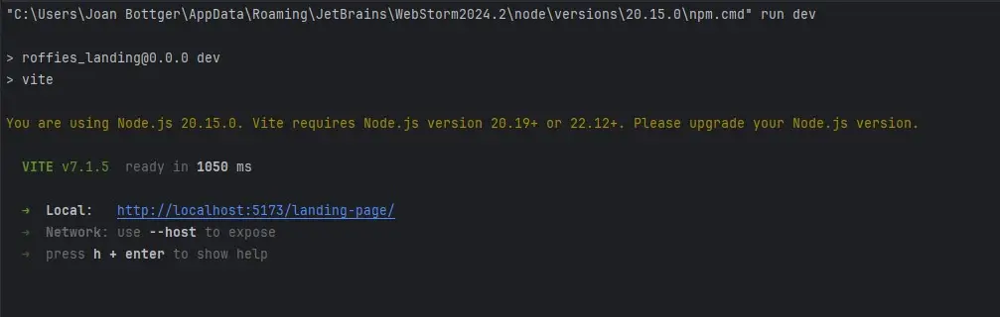

| Repository | Branch | Commit ID | Message | Body | Commit Date  |
|---|---|---|---|---|---|
| Roffies | 12/9/2025  | 21:00  | Reunión mediante Google Meet  |   |   |

#### 5.2.1.5 Testing Suite Evidence for Sprint Review
No aplica a primer sprint y desarrollo de Landing Page.

#### 5.2.1.6 Execution Evidence for Sprint Review
Se incluyen capturas detalladas de la ejecución de la Landing Page de la aplicación como evidencia.
La Landing Page es compuesta por varias secciones que se presentan en las capturas a continuación.

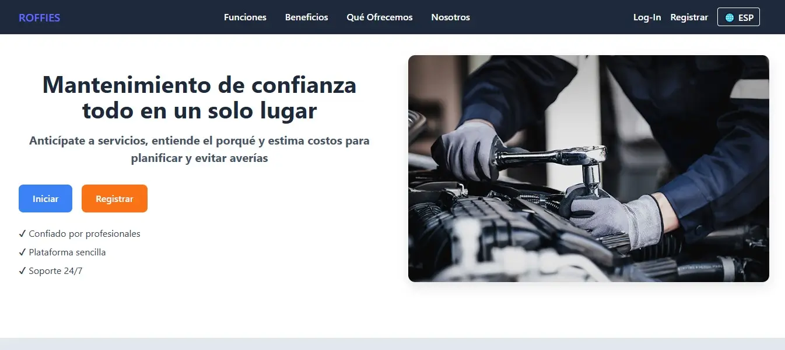
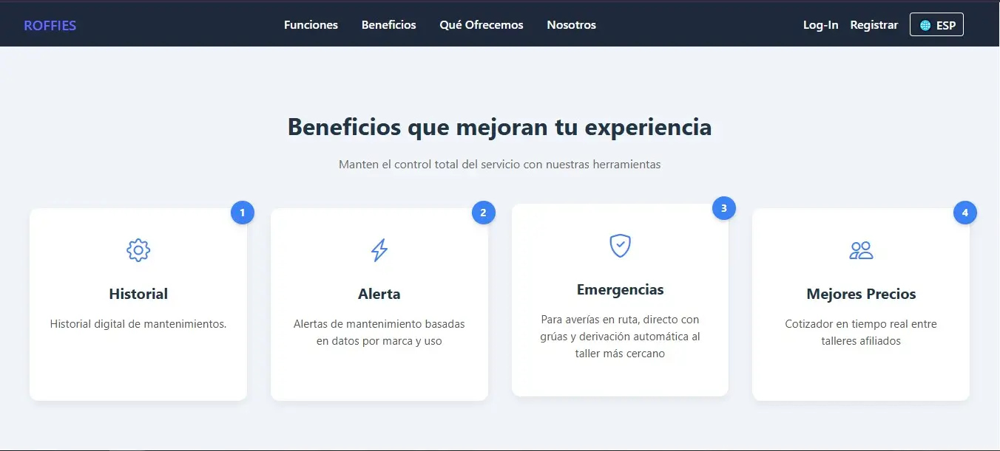

#### 5.2.1. Services Documentation Evidence for Sprint Review
No aplica a primer sprint y desarrollo de Landing Page.

#### 5.2.1.7. Software Deployment Evidence for Sprint Review
Se incluye la evidencia de despliegue del Landing Page en la plataforma Github Pages.

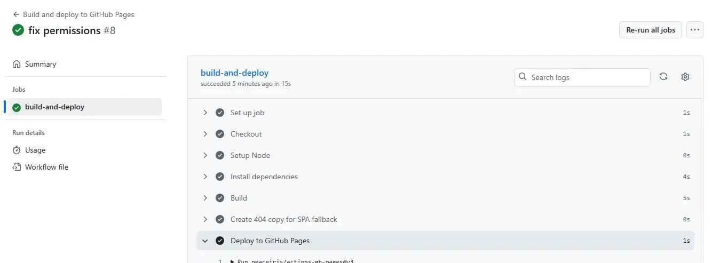

#### 5.2.1.8 Team Collaboration Insights during Sprint
Durante el transcurso de este sprint, todos los miembros participaron de forma activa y constante en la creación de las tareas asignadas. A continuación todos los analíticos que nos proporciona Github, en su apartado de Insights, sobre la colaboración del
equipo durante el Sprint 1:

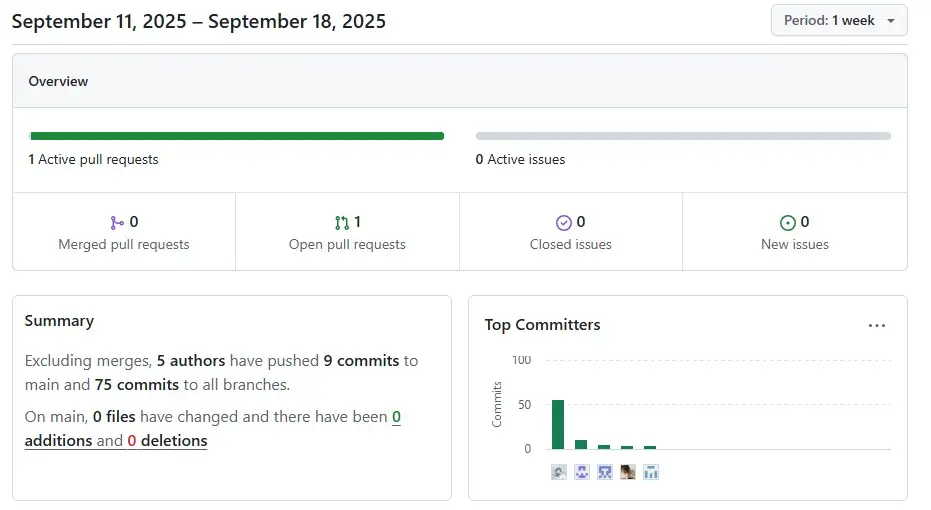

### 5.2.2 Sprint 2
Durante este período, nos enfocamos en la implementación de las características y funcionalidades prioritarias identificadas en la planificación inicial. Esto implica traducir los requisitos y especificaciones en código funcional, desarrollando las bases de nuestro producto de manera iterativa.

#### 5.2.2.1 Sprint Planning 2
En esta sección, se presentará el sprint #2 con la versión inicial del trabajo para la entrega del proyecto, detallando la organización, distribución y evidencia de resultados de la frontend Web Application.

| Sprint  | Date  | Time  | Location  | Prepared By  | Attendees  |
|---|---|---|---|---|---|
| 2  | 28/9/2025  | 21:00  | Reunión mediante Google Meet  | Luis Sebastián Rubio  | Johan Bottger, Pierina Carbajal, Piero Sulca, Rubens Bendezu |
| Sprint 2 Goal  | Sprint 2 Velocity  | Sum of Story Points  | Aspectos Técnicos  |
|---|---|---|
| Desarrollo e Implementación del Frontend Web Application | 15  | 15 | HTML5, CSS3, JS, Figma, Vue, Primevue  |

#### 5.2.2.2. Aspect Leaders and Collaborators
Los aspectos principales considerados para el sprint corresponden a los bounded contexts aplicados en el desarrollo del frontend web Application.

| Team Member | Github Username | Frontend Main (Context Auth) | Feature Appointments | Feature Workshop | Feature Profile | Feature Vehicle |
|-----------|-----------|-----------|-----------|-----------|-----------|-----------|
| Piero Ángel Sulca Sánchez | psulca | L | C | C5 | C | C |
| Johan Karl Bottger Salazar | Deskjobo | C | L | C | C | C |
| Luis Sebastián Rubio Ortiz | notoriussxd | C | C | C | L | C |
| Pierina Marysabel Almandroz Carbajal | pierinaaa29 | C | C | C | C | L |
| Rubens Bendezú Navaro | Lucemz | C | C | L | C | C |

#### 5.2.2.3 Sprint Backlog 2
Durante este segundo Sprint el equipo se enfocó en la elaboración del frontend, organizando y distribuyendo tareas en el tablero de Sprint de acuerdo con las habilidades de cada integrante.

| Sprint 2  | Frontend Web Application|           |           |           |           |
|-----------|-----------|-----------|-----------|-----------|-----------|
| User Story | Work-Item Task | Description | Estimation hrs | Assigned To | Status |
| HU02 Authentication | Development of Bounded Context | - | 3 | Piero Sulca | Done |
| HU03 Feature Appointments | Development of Bounded Context | - | 3 | Johan Bottger | Done |
| HU04 Feature Workshop | Development of Bounded Context | - | 3 | Rubens Bendezú | Done |
| HU05 Feature Profile | Development of Bounded Context | - | 3 | Sebastián Rubio | Done |
| HU06 Feature Vehicle | Development of Bounded Context | - | 3 | Pierina Almandroz | Done |

#### 5.2.2.4 Development Evidence for Sprint Review
En esta sección se explica y presenta los avances en implementación con relación a los productos de la solución según el alcance del segundo Sprint: Frontend Web Application.

A continuación, se presentan los commits más importantes para el Reporte, los cuales muestran el ciclo de vida del proyecto, y toda la información que se usó para el desarrollo del proyecto.

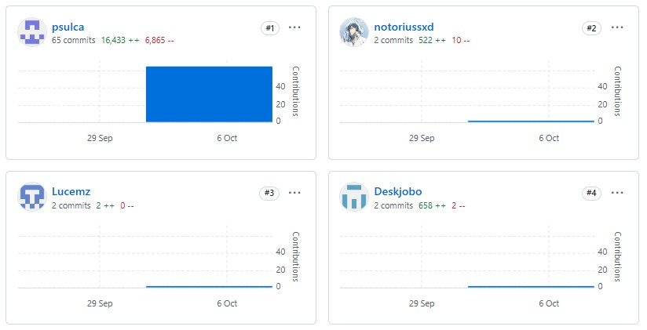

| Repository | Branch | Commit ID | Message | Body | Commit Date  |
|---|---|---|---|---|---|
| Roffies | feature-profile-workshop | 019717ba6661b2858e5f97c3bcaa60023783ec52 | feat: Add feature Profile in view Workshop Profile | - | 7/10/2025 |
| Roffies | feature-appointments | 1bc2f7faefc7a81d5035e2f8c8001922e6beae70 | Feat: Added Appointment Service for Driver domain | - | 8/10/2025 |

#### 5.2.2.5 Testing Suite Evidence for Sprint Review
No aplica.

#### 5.2.2.6 Execution Evidence for Sprint Review
Se incluyen capturas detalladas de la ejecución del Frontend Web Application de la aplicación como evidencia.
La Landing Page es compuesta por varias secciones que se presentan en las capturas a continuación.

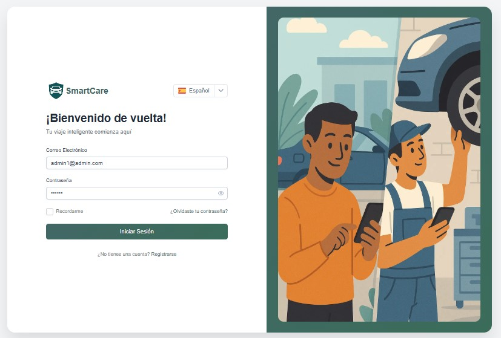

#### 5.2.2.7 Services Documentation Evidence for Sprint Review
No aplica a primer sprint y desarrollo del Frontend Web Application.

#### 5.2.2.8 Software Deployment Evidence for Sprint Review
Se incluye la evidencia de despliegue del Frontend Web Application en Vercel.

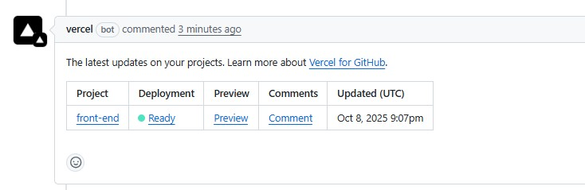

<https://front-end-alpha-weld.vercel.app/>

#### 5.2.2.9 Team Collaboration Insights during Sprint
Durante el transcurso de este sprint, todos los miembros participaron de forma activa y constante en la creación de las tareas asignadas. A continuación todos los analíticos que nos proporciona Github, en su apartado de Insights, sobre la colaboración del
equipo durante el Sprint 2:

### 5.2.3 Sprint 3
Este período consistió en la implementación de las características y funcionalidades prioritarias identificadas en la planificación inicial. Esto implica traducir los requisitos y especificaciones en código funcional, desarrollando nuestro producto de manera iterativa.

#### 5.2.3.1 Sprint Planning 3
En esta sección, se presentará el sprint #3 con la versión inicial del trabajo para la entrega del proyecto, detallando la organización, distribución y evidencia de resultados de la backend Web Service.

| Sprint  | Date  | Time  | Location  | Prepared By  | Attendees  |
|---|---|---|---|---|---|
| 3  |1 /11/2025  | 21:00  | Reunión mediante Google Meet  | Johan Bottger | Luis Sebastián Rubio, Piero Sulca, Rubens Bendezu |
| Sprint 3 Goal  | Sprint 3  Velocity  | Sum of Story Points  | Aspectos Técnicos  |
|---|---|---|
| Desarrollo e Implementación del Backend Web Service | 14  | 14 | C#, .NET  |

#### 5.2.3.2. Aspect Leaders and Collaborators
Los aspectos principales considerados para el sprint corresponden a los bounded contexts aplicados en el desarrollo del backend web Service.

| Team Member | Github Username | Backend Main (Context Auth) | Context Appointments | Context Workshop | Context Profile | Context Vehicle |
|-----------|-----------|-----------|-----------|-----------|-----------|-----------|
| Piero Ángel Sulca Sánchez | psulca | C | C | C | C | C |
| Johan Karl Bottger Salazar | Deskjobo | L | L | L | L | L |
| Luis Sebastián Rubio Ortiz | notoriussxd | C | C | C | C | C |
| Rubens Bendezú Navaro | Lucemz | C | C | C | C | C |

#### 5.2.3.3 Sprint Backlog 3
Durante este tercer Sprint se enfocó en la elaboración del backend, organizando y distribuyendo tareas en el tablero de Sprint.

| Sprint 3  | Backend Web Service |           |           |           |           |
|-----------|-----------|-----------|-----------|-----------|-----------|
| User Story | Work-Item Task | Description | Estimation hrs | Assigned To | Status |
| HU02 Authentication | Development of Bounded Context | - | 3 | Piero Sulca | Done |
| HU03 Feature Appointments | Development of Bounded Context | - | 3 | Johan Bottger | Done |
| HU04 Feature Workshop | Development of Bounded Context | - | 3 | Rubens Bendezú | Done |
| HU05 Feature Profile | Development of Bounded Context | - | 3 | Sebastián Rubio | Done |
| HU06 Feature Vehicle | Development of Bounded Context | - | 3 | Johan Bottger | Done |

#### 5.2.3.4 Development Evidence for Sprint Review 
En esta sección se explica y presenta los avances en implementación con relación a los productos de la solución según el alcance del tercer Sprint: Backend Web Service.

A continuación, se presentan los commits más importantes para el Reporte, los cuales muestran el ciclo de vida del proyecto, y toda la información que se usó para el desarrollo del proyecto.

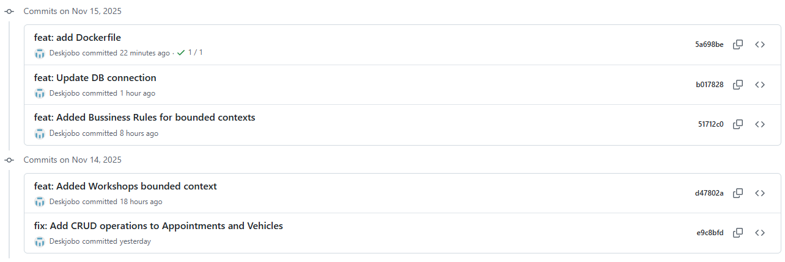

| Repository | Branch | Commit ID | Message | Body | Commit Date  |
|---|---|---|---|---|---|
| Roffies | main | 2b29f3e94fe5bc2d53dd3f243894f53a07cd0746 | feat: Commit inicial back-end setup | - | 12/11/2025 |
| Roffies | main | 51712c05c0a5a2cb7fee7467526393a7095d5345 | feat: Added Bussiness Rules for bounded contexts | - | 14/11/2025 |
| Roffies | main | 5a698be56991a69bc7c3338d7d56da8956a08cf3 | feat: add Dockerfile | - | 15/10/2025 |

#### 5.2.3.5 Testing Suite Evidence for Sprint Review
No aplica.

#### 5.2.3.6 Execution Evidence for Sprint Review
Se incluyen capturas detalladas de la ejecución del Backend Web Service de la aplicación como evidencia.

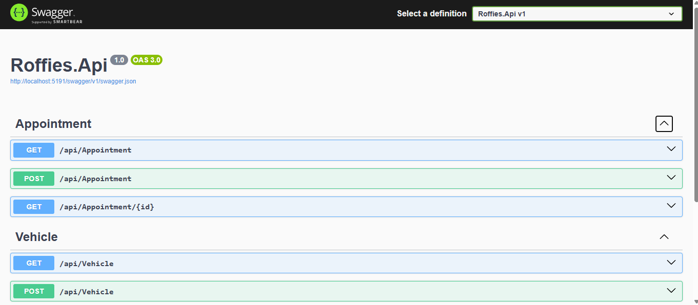

#### 5.2.3.7 Services Documentation Evidence for Sprint Review
A continuación se detalla la implementación de cada endpoint que compone el conjunto de servicios del backend.

| Endpoint | Actions | URL | Context |
|---|---|---|---|---|---|
| Appointment | get-post-get(id)-put | /api/Appointment | Appointments |
| User | get-post-get(id)-put/delete | /api/User | Users |
| Vehicle | get-post-get(id)-delete | /api/Vehicle | Vehicles |
| Workshop | get-post-get(id)-put/delete | /api/Workshop | Workshops |

Evidencia de respuestas e implementación de documentación OpenApi.

#### 5.2.3.8 Software Deployment Evidence for Sprint Review
Se incluye la evidencia de despliegue del Backend Web Service y de la base de datos SQL utilizada.

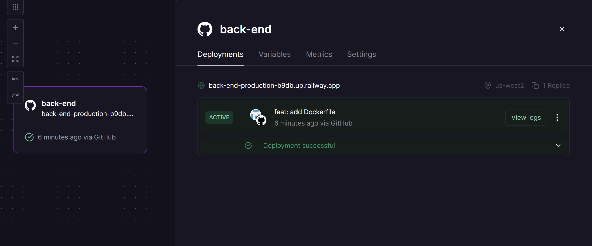
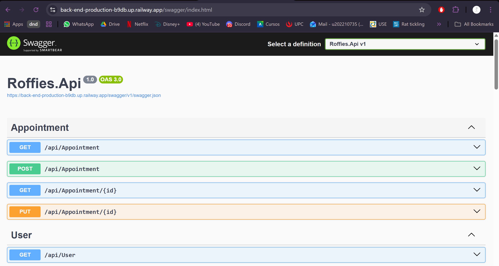

Enlace con documentación Swagger:
https://back-end-production-b9db.up.railway.app/swagger

#### 5.2.3.8 Team Collaboration Insights during Sprint
Durante el transcurso de este sprint, la participación completa del equipo fue limitada. A continuación todos los analíticos que nos proporciona Github, en su apartado de Insights, sobre la colaboración del
equipo durante el Sprint 3:

## 5.3 Validation Interviews

### 5.3.1 Diseño de Entrevistas

En esta sección se tiene las entrevistas a realizar a los segmentos objetivos, tanto los dueños de vehiculos como los dueños de talleres.
Preguntas a realizar:
1. Cuál es tu nombre?
2. ¿Qué edad tienes?
3. ¿Dónde vives actualmente?
4. ¿A qué te dedicas?
5. ¿Qué característica te llama más la atención del aplicativo? ¿Por qué?
6. ¿Qué opinas sobre el diseño de nuestro panel de control y las multiples herramientas que ofrece?
7. ¿Qué funcionalidades le agregarias a la aplicación?
8. ¿Hay alguna cosa que le quitarías a la aplicación?
9. Como (Segmento objetivo) ¿Tienes alguna recomendación que ayude a mejorar la experiencia de uso de la aplicación?

### 5.3.2 Registro de Entrevistas

## Entrevista para el Segmento Objetivo 1 - Dueños de vehículos:

**Entrevista N°1:**

**Entrevistado:** Sebastián De Las Casas  

**Sexo:** Masculino

**Edad:** 21 años 

**Inicio de la Entrevista:** 0:00

**Duración de la Entrevista:** 2:40

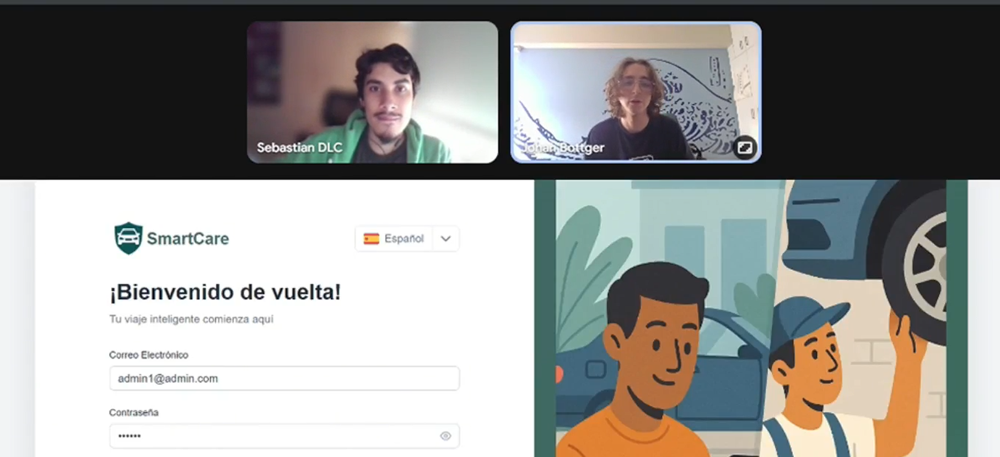

**Resumen de la Entrevista:**
Sebastián, conductor de 21 años, realiza chequeos a su vehículo de manera periódica (cada seis meses o una vez al año). Resaltó su satisfacción con la funcionalidad de historial del producto, cumpliendo con su necesidad de un registro del trabajo realizado en su vehículo. Aprueba el diseño visual de la aplicación web. Sugiere la implementación de notificaciones.

**Enlace:** https://upcedupe-my.sharepoint.com/:v:/g/personal/u202210735_upc_edu_pe/IQBU70VDu3MJT7pYOqa4o9DMAU3IBr9D8Dt9rlMz6QfeGek?nav=eyJyZWZlcnJhbEluZm8iOnsicmVmZXJyYWxBcHAiOiJTdHJlYW1XZWJBcHAiLCJyZWZlcnJhbFZpZXciOiJTaGFyZURpYWxvZy1MaW5rIiwicmVmZXJyYWxBcHBQbGF0Zm9ybSI6IldlYiIsInJlZmVycmFsTW9kZSI6InZpZXcifX0%3D&e=17eT1y

---

# Entrevista N°2

**Entrevistada:** Ingrid Ysa  
**Sexo:** Femenino  
**Edad:** 21 años  

**Inicio de la Entrevista:** 0:00  
**Duración de la Entrevista:** 2:15  

**Resumen de la Entrevista:**  
Ingrid, conductora de 21 años, señala que la aplicación le resulta conveniente porque evita la búsqueda manual de talleres y hace que el proceso de atención fluya con mayor rapidez. Comenta que la interfaz es sencilla de usar y que la experiencia le parece eficiente y práctica.

**Enlace:** https://youtu.be/QZ9tY4oI-w8

---

# Entrevista N°3

**Entrevistado:** Juan Diego Carranza  
**Sexo:** Masculino  
**Edad:** 26 años  

**Inicio de la Entrevista:** 0:00  
**Duración de la Entrevista:** 4:36  

**Resumen de la Entrevista:**  
Juan Diego, propietario de un vehículo, expresa su satisfacción general con la aplicación, destacando que le facilita encontrar servicios y gestionar el mantenimiento de su carro sin complicaciones. Además, menciona que le gustaría contar con una funcionalidad adicional que muestre un **progreso detallado del estado de su reparación**, indicando etapas como diagnóstico, avance y finalización. Considera que esta característica aumentaría la confianza y transparencia del proceso.

**Enlace:** https://youtu.be/QZ9tY4oI-w8

## Entrevista para el Segmento Objetivo 2 - Dueños de Talleres: 

**Entrevista N°2:**

**Entrevistado:** Diego Cacho 

**Sexo:** Masculino

**Edad:** 20 años 

**Inicio de la Entrevista:** 0:00

**Duración de la Entrevista:** 2:36

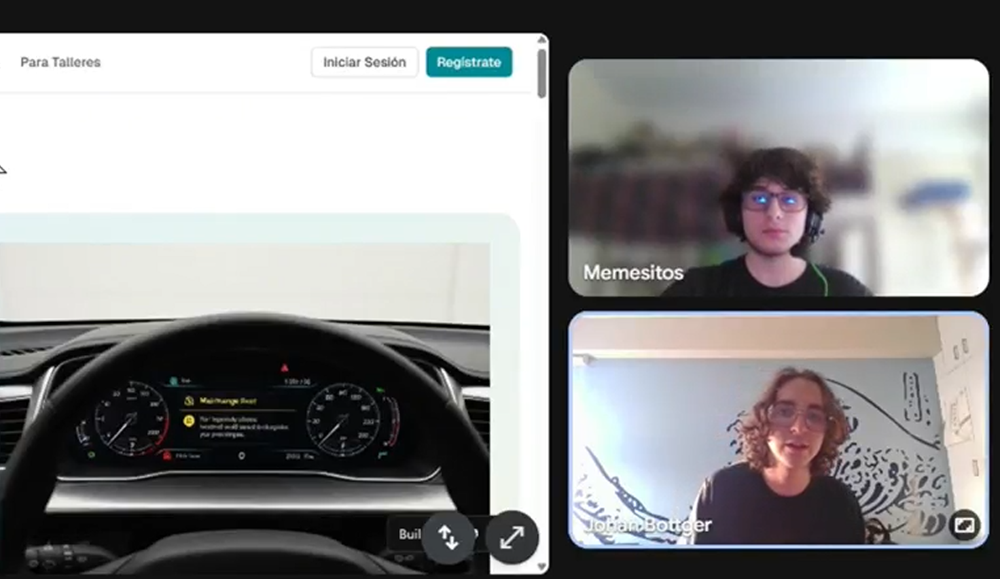

**Resumen de la Entrevista:**
Diego trabaja en tiempo medio en un taller de automóviles por los últimos 2 años. Diego resalta el orden de las funcionalidades de la aplicación y lo considera una mejora sustancial al proceso actual de manejo de servicios del taller. Destaca la funcionalidad de un registro de clientes. Sugiere mayor expansión en la funcionalidad de perfil de taller para mejorar su alcance al público.

**Enlace:** https://upcedupe-my.sharepoint.com/:v:/g/personal/u202210735_upc_edu_pe/IQBW97dQ3YgGRbYtUPr8Jc2MAZlZuV-CwrjjK3f-CHKpVTU?nav=eyJyZWZlcnJhbEluZm8iOnsicmVmZXJyYWxBcHAiOiJTdHJlYW1XZWJBcHAiLCJyZWZlcnJhbFZpZXciOiJTaGFyZURpYWxvZy1MaW5rIiwicmVmZXJyYWxBcHBQbGF0Zm9ybSI6IldlYiIsInJlZmVycmFsTW9kZSI6InZpZXcifX0%3D&e=Qibh7G

### 5.3.3 Evaluación según heurísticas

## 5.4 Video About-the-Product

